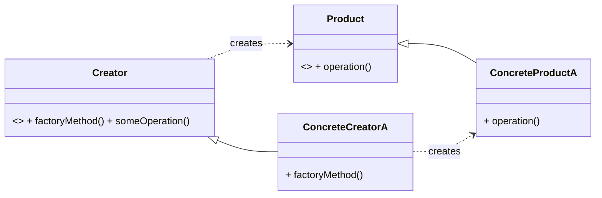

# Cheatsheet: Factory Method Pattern

**Category:** Creational

**Problem:** Directly instantiating objects (e.g., `product = ConcreteProduct()`) creates tight coupling, making it hard to change or add new product types without modifying client code.

**Solution:** Define an interface (or abstract class) for creating an object, but let subclasses decide which class to instantiate. The Factory Method defers instantiation to subclasses.

---

### Structure



---

### Key Components

-   **Product:** The interface for objects the factory method creates (e.g., `Notification`).
-   **ConcreteProduct:** Specific implementations of the Product (e.g., `EmailNotification`, `SMSNotification`).
-   **Creator:** Declares the `factory_method` (abstract) and may contain core logic that uses the product (e.g., `NotificationCreator`).
-   **ConcreteCreator:** Implements the `factory_method` to return a specific `ConcreteProduct` (e.g., `EmailNotificationCreator`).

---

### Python Example (Conceptual)

```python
# Product
class Notification(ABC):
    @abstractmethod
    def send(self, msg): pass

class EmailNotification(Notification):
    def send(self, msg): return f"Email: {msg}"

# Creator
class NotificationCreator(ABC):
    @abstractmethod
    def factory_method(self) -> Notification: pass

    def deliver(self, msg): return self.factory_method().send(msg)

class EmailCreator(NotificationCreator):
    def factory_method(self): return EmailNotification()

# Usage
creator = EmailCreator()
creator.deliver("Hello!")
```

---

### Pros & Cons

-   **Pros:** Loose coupling, adheres to SRP and OCP, easy to introduce new product types.
-   **Cons:** Increases complexity (more classes), requires subclassing for each new product.
