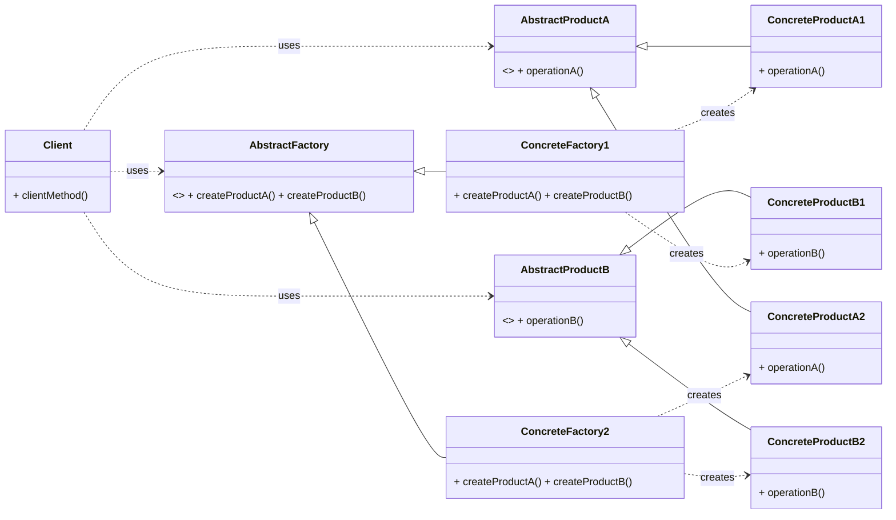

# Cheatsheet: Abstract Factory Pattern

**Category:** Creational

**Problem:** Need to create families of related or dependent objects without specifying their concrete classes. Often used when an application needs to be independent of how its products are created, composed, and represented.

**Solution:** Provide an interface for creating families of related or dependent objects without specifying their concrete classes. Each concrete factory creates a specific variant of the product family.

---

### Structure



---

### Key Components

-   **Abstract Factory:** Declares an interface for creating each distinct product in a family (e.g., `GUIFactory`).
-   **Concrete Factory:** Implements the creation methods for products of a specific variant (e.g., `WindowsFactory`, `MacOSFactory`).
-   **Abstract Product:** Declares an interface for a type of product object (e.g., `Button`, `Checkbox`).
-   **Concrete Product:** Defines a product object created by the corresponding concrete factory (e.g., `WindowsButton`, `MacOSCheckbox`).
-   **Client:** Uses interfaces from the Abstract Factory and Abstract Product classes.

---

### Python Example (Conceptual)

```python
# Abstract Products
class Button(ABC):
    @abstractmethod
    def paint(self): pass

class Checkbox(ABC):
    @abstractmethod
    def paint(self): pass

# Concrete Products
class WinButton(Button): ...
class MacButton(Button): ...
class WinCheckbox(Checkbox): ...
class MacCheckbox(Checkbox): ...

# Abstract Factory
class GUIFactory(ABC):
    @abstractmethod
    def create_button(self) -> Button: pass
    @abstractmethod
    def create_checkbox(self) -> Checkbox: pass

# Concrete Factories
class WinFactory(GUIFactory):
    def create_button(self): return WinButton()
    def create_checkbox(self): return WinCheckbox()

class MacFactory(GUIFactory):
    def create_button(self): return MacButton()
    def create_checkbox(self): return MacCheckbox()

# Client
def app(factory: GUIFactory):
    button = factory.create_button()
    checkbox = factory.create_checkbox()
    print(button.paint(), checkbox.paint())

# Usage
app(WinFactory())
app(MacFactory())
```

---

### Pros & Cons

-   **Pros:** Ensures product compatibility, isolates concrete classes, easy to add new product families.
-   **Cons:** Difficult to add new product types (requires modifying AbstractFactory and all ConcreteFactories).
