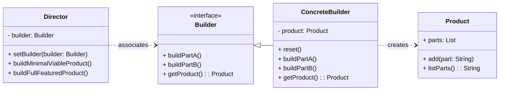

# Cheatsheet: Builder Pattern

**Category:** Creational

**Problem:** Constructing a complex object with many optional parts or configurations can lead to overly complex constructors ("telescoping constructor") or inconsistent states if using setters.

**Solution:** Separate the construction of a complex object from its representation, allowing the same construction process to create different representations. It involves a `Director` that constructs an object using a `Builder` interface.

---

### Structure



---

### Key Components

-   **Product:** The complex object being built. It doesn't require a common interface as different builders can create entirely different products.
-   **Builder:** Declares an abstract interface for creating parts of a Product object. It defines methods for building each component of the product.
-   **ConcreteBuilder:** Implements the `Builder` interface to construct and assemble parts of the product. It provides a specific implementation for each building step and keeps track of the product it's building.
-   **Director:** Constructs an object using the `Builder` interface. It knows the sequence of building steps but not the specific concrete builder or product. It can construct several variations of the product using the same building steps.

---

### Python Example (Conceptual)

```python
# Product
class Car: ...

# Builder Interface
class CarBuilder(ABC):
    @abstractmethod
    def build_engine(self): pass
    @abstractmethod
    def build_wheels(self): pass
    @abstractmethod
    def get_result(self) -> Car: pass

# Concrete Builder
class SportsCarBuilder(CarBuilder):
    def build_engine(self): self.car.engine = "V8"
    def build_wheels(self): self.car.wheels = "sporty"
    def get_result(self): return self.car

# Director
class Director:
    def construct_sports_car(self, builder: CarBuilder):
        builder.build_engine()
        builder.build_wheels()

# Usage
director = Director()
builder = SportsCarBuilder()
director.construct_sports_car(builder)
car = builder.get_result()
```

---

### Pros & Cons

-   **Pros:** Step-by-step construction, separation of concerns, reusable construction code, fine-grained control over product complexity.
-   **Cons:** Increased complexity (more classes) for simple objects, product might be in an inconsistent state during construction.
