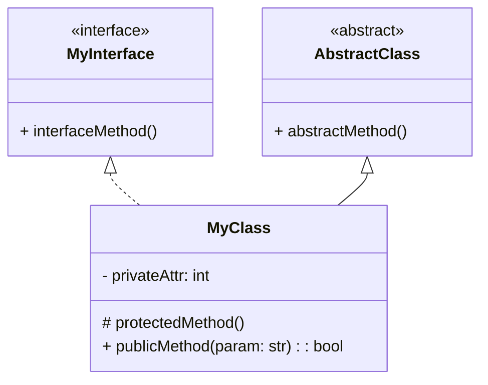

# Cheatsheet: UML Class Diagrams

**Concept:** Standard visual tool for modeling the static structure of a system, showing classes, their attributes, methods, and relationships.

---

### 1. Class Representation

-   **Rectangle:** Divided into three sections.
    1.  **Name:** Class Name.
    2.  **Attributes:** `[visibility] name: type [= default_value]`
    3.  **Methods:** `[visibility] name(parameters): return_type`

-   **Visibility Symbols:**
    -   `+`: Public
    -   `-`: Private
    -   `#`: Protected

-   **Abstract Class:** Name/methods in *italics* or `<<abstract>>` stereotype.
-   **Interface:** `<<interface>>` stereotype or lollipop notation.



---

### 2. Relationships

-   **Inheritance (Generalization):** "Is-a" relationship. Solid line with **hollow triangular arrowhead** pointing to superclass.
    `Subclass --|> Superclass`

-   **Implementation (Realization):** Class implements an interface. Dashed line with **hollow triangular arrowhead** pointing to interface.
    `Class --|> <<interface>>Interface`

-   **Association:** General relationship between two classes. Can have multiplicity.
    `ClassA -- ClassB`
    -   **Multiplicity:** `1` (one), `0..1` (zero or one), `1..*` (one or many), `*` (zero or many).

-   **Aggregation:** "Has-a" (weak) relationship. Part can exist independently. Solid line with **hollow diamond** on the "whole" side.
    `Whole o-- Part`

-   **Composition:** "Has-a" (strong) relationship. Part cannot exist independently. Solid line with **filled diamond** on the "whole" side.
    `Whole *-- Part`

-   **Dependency:** "Uses-a" (temporary/weak) relationship. One class uses another (e.g., as a method parameter). Dashed line with **open arrowhead**.
    `User --..> Service`

```mermaid
classDiagram
    Animal <|-- Dog
    Vehicle o-- Wheel
    Car *-- Engine
    Order -- Customer
    Processor --..> Data
```

---

### 3. Common Use

-   Visualize system structure.
-   Communicate design decisions.
-   Understand design patterns.
-   Plan new features or refactorings.
