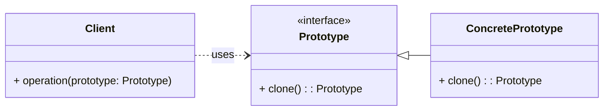

# Cheatsheet: Prototype Pattern

**Category:** Creational

**Problem:** Creating new objects directly can be inefficient or complex, especially when the object's creation process involves heavy resource allocation or when the object's type is determined at runtime.

**Solution:** Specify the kinds of objects to create using a prototypical instance, and create new objects by copying this prototype. This allows for creating new objects at runtime without knowing their specific types.

---

### Structure



---

### Key Components

-   **Prototype:** Declares an interface for cloning itself (e.g., `Document` with `clone()`).
-   **Concrete Prototype:** Implements the `clone()` operation to create a copy of itself (e.g., `Report`, `Presentation`). This often involves `copy.copy()` for shallow copies or `copy.deepcopy()` for deep copies in Python.
-   **Client:** Creates a new object by asking a prototype to clone itself, without knowing the concrete class of the prototype.

---

### Python Example (Conceptual)

```python
import copy
from abc import ABC, abstractmethod

# Prototype Interface
class Shape(ABC):
    def __init__(self, x, y):
        self.x = x
        self.y = y

    @abstractmethod
    def clone(self):
        pass

# Concrete Prototype
class Circle(Shape):
    def __init__(self, x, y, radius):
        super().__init__(x, y)
        self.radius = radius

    def clone(self):
        return copy.deepcopy(self)

# Client Code
if __name__ == "__main__":
    circle1 = Circle(10, 20, 5)
    circle2 = circle1.clone()

    print(f"Circle 1: {circle1.x}, {circle1.y}, {circle1.radius}")
    print(f"Circle 2: {circle2.x}, {circle2.y}, {circle2.radius}")

    circle2.x = 30
    print(f"Circle 1 (after modification): {circle1.x}")
    print(f"Circle 2 (after modification): {circle2.x}")
```

---

### Pros & Cons

-   **Pros:** Efficient object creation (especially for complex objects), decouples client from concrete classes, allows dynamic object creation, reduces subclassing.
-   **Cons:** Complex cloning logic (deep vs. shallow copy), not always applicable (objects might not support copying).
