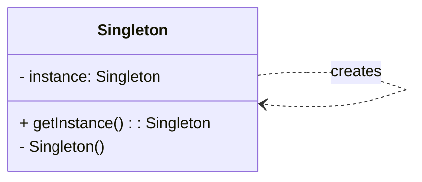

# Cheatsheet: Singleton Pattern

**Category:** Creational

**Problem:** Ensure that a class has only one instance and provide a global point of access to that instance. This is useful for objects that manage shared resources (e.g., database connection, logger, configuration).

**Solution:** Restrict the instantiation of a class to a single object. This can be achieved by making the constructor private and providing a static method to get the instance.

---

### Structure (Conceptual)



---

### Key Concepts & Python Implementations

-   **Ensures Single Instance:** The core idea is to prevent multiple instantiations of a class.
-   **Global Access Point:** Provides a well-known way to retrieve the single instance.

#### Common Python Implementations:

1.  **Using `__new__` method:**
    The `__new__` method is called before `__init__` when creating an object. By overriding it, you can control the instance creation.

    ```python
    class MySingleton:
        _instance = None

        def __new__(cls):
            if cls._instance is None:
                cls._instance = super(MySingleton, cls).__new__(cls)
                # Initialize here if needed
            return cls._instance

    # Usage
    s1 = MySingleton()
    s2 = MySingleton()
    print(s1 is s2) # True
    ```

2.  **Using a Decorator:**
    A decorator can wrap a class and manage its instances in a dictionary.

    ```python
    def singleton(cls):
        instances = {}
        def get_instance(*args, **kwargs):
            if cls not in instances:
                instances[cls] = cls(*args, **kwargs)
            return instances[cls]
        return get_instance

    @singleton
    class MyDecoratedSingleton:
        def __init__(self, value):
            self.value = value

    # Usage
    s1 = MyDecoratedSingleton(1)
    s2 = MyDecoratedSingleton(2)
    print(s1 is s2) # True
    print(s1.value) # 1 (initialization only happens once)
    ```

3.  **Using a Metaclass:**
    Metaclasses control the creation of classes themselves. This is a more advanced but powerful way to implement singletons.

    ```python
    class SingletonMeta(type):
        _instances = {}
        def __call__(cls, *args, **kwargs):
            if cls not in cls._instances:
                cls._instances[cls] = super(SingletonMeta, cls).__call__(*args, **kwargs)
            return cls._instances[cls]

    class MyMetaclassSingleton(metaclass=SingletonMeta):
        def __init__(self, value):
            self.value = value

    # Usage
    s1 = MyMetaclassSingleton(1)
    s2 = MyMetaclassSingleton(2)
    print(s1 is s2) # True
    print(s1.value) # 1
    ```

---

### Pros & Cons

-   **Pros:** Ensures single instance, global access point, controlled instantiation, useful for resource management.
-   **Cons:** Violates Single Responsibility Principle, can hide bad design (global state), difficult to test, potential concurrency issues in multi-threaded environments if not implemented carefully.
