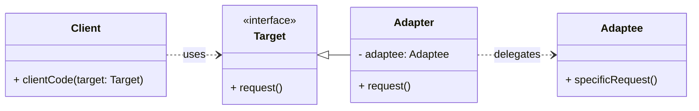

# Cheatsheet: Adapter Pattern

**Category:** Structural

**Problem:** You have existing classes with incompatible interfaces, and you need them to work together without modifying their source code.

**Solution:** Convert the interface of a class into another interface clients expect. The Adapter pattern lets classes work together that couldn't otherwise because of incompatible interfaces.

---

### Structure



---

### Key Components

-   **Target:** Defines the domain-specific interface that `Client` uses (e.g., `MediaPlayer` with `play()`).
-   **Adaptee:** Defines an existing interface that needs adapting. This is the incompatible class (e.g., `WAVPlayer` with `play_wav()`).
-   **Adapter:** Implements the `Target` interface and holds an instance of the `Adaptee`. It translates requests from `Target` to `Adaptee` (e.g., `WAVPlayerAdapter`).
-   **Client:** Collaborates with objects conforming to the `Target` interface.

---

### Python Example (Conceptual)

```python
from abc import ABC, abstractmethod

# Target
class NewSystem(ABC):
    @abstractmethod
    def process_data(self, data: str):
        pass

# Adaptee
class OldSystem:
    def handle_legacy_data(self, raw_data: str):
        return f"Processing legacy data: {raw_data.upper()}"

# Adapter
class OldSystemAdapter(NewSystem):
    def __init__(self, old_system: OldSystem):
        self._old_system = old_system

    def process_data(self, data: str):
        # Adapt the new interface call to the old system's interface
        return self._old_system.handle_legacy_data(data)

# Client
def client_app(system: NewSystem, input_data: str):
    print(system.process_data(input_data))

# Usage
old_system_instance = OldSystem()
adapter = OldSystemAdapter(old_system_instance)
client_app(adapter, "hello world")
```

---

### Pros & Cons

-   **Pros:** Reusability of existing code, flexibility (loose coupling), transparency to the client, adheres to SRP.
-   **Cons:** Increased complexity (new class), potential slight performance overhead.
