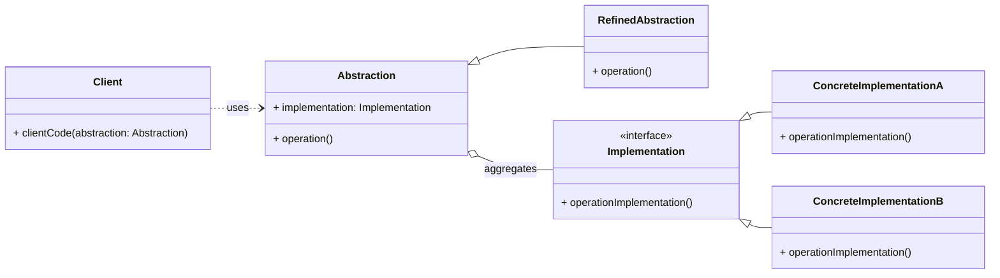

# Cheatsheet: Bridge Pattern

**Category:** Structural

**Problem:** When you have a class hierarchy and you also need to vary its implementation, leading to a complex, unmanageable class explosion if not handled correctly. This is tight coupling between abstraction and implementation.

**Solution:** Decouple an abstraction from its implementation so that the two can vary independently. It involves separating a class into two distinct hierarchies: an `Abstraction` hierarchy and an `Implementation` hierarchy.

---

### Structure



---

### Key Components

-   **Abstraction:** Defines the abstraction's interface. It maintains a reference to an object of type `Implementation` (e.g., `RemoteControl`).
-   **Refined Abstraction:** Extends the `Abstraction` interface, providing more specific control or functionality (e.g., `AdvancedRemoteControl`).
-   **Implementation:** Declares the interface for implementation classes. It doesn't have to correspond exactly to `Abstraction`'s interface (e.g., `Device`).
-   **Concrete Implementation:** Implements the `Implementation` interface, providing concrete functionality (e.g., `TV`, `Radio`).

---

### Python Example (Conceptual)

```python
from abc import ABC, abstractmethod

# Implementation Interface
class DrawingAPI(ABC):
    @abstractmethod
    def draw_circle(self, x, y, radius):
        pass

# Concrete Implementations
class OpenGLAPI(DrawingAPI):
    def draw_circle(self, x, y, radius):
        return f"Drawing circle with OpenGL at ({x},{y}) with radius {radius}"

class SVGAPI(DrawingAPI):
    def draw_circle(self, x, y, radius):
        return f"Drawing circle with SVG at ({x},{y}) with radius {radius}"

# Abstraction
class Shape(ABC):
    def __init__(self, drawing_api: DrawingAPI):
        self._drawing_api = drawing_api

    @abstractmethod
    def draw(self):
        pass

# Refined Abstraction
class Circle(Shape):
    def __init__(self, x, y, radius, drawing_api: DrawingAPI):
        super().__init__(drawing_api)
        self.x = x
        self.y = y
        self.radius = radius

    def draw(self):
        return self._drawing_api.draw_circle(self.x, self.y, self.radius)

# Client Code
if __name__ == "__main__":
    opengl_circle = Circle(1, 2, 3, OpenGLAPI())
    print(opengl_circle.draw())

    svg_circle = Circle(4, 5, 6, SVGAPI())
    print(svg_circle.draw())
```

---

### Pros & Cons

-   **Pros:** Decouples abstraction and implementation, improves extensibility (can extend both independently), better maintainability, hides implementation details from clients.
-   **Cons:** Increased complexity (more classes and interfaces), requires careful initial design.
