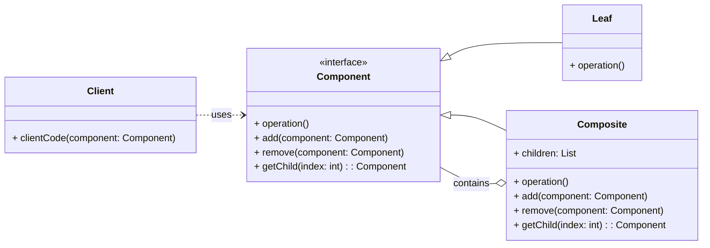

# Cheatsheet: Composite Pattern

**Category:** Structural

**Problem:** When you need to treat individual objects and compositions of objects uniformly. This often occurs in tree-like structures where both individual nodes (leaves) and branches (composites) need to be handled in a similar manner.

**Solution:** Compose objects into tree structures to represent part-whole hierarchies. The Composite pattern lets clients treat individual objects and compositions of objects uniformly.

---

### Structure



---

### Key Components

-   **Component:** Declares the interface for objects in the composition. It implements default behavior for the interface common to all classes, and declares an interface for accessing and managing its child components (e.g., `FileSystemComponent`).
-   **Leaf:** Represents leaf objects in the composition. A leaf has no children and implements the `Component` interface directly (e.g., `File`).
-   **Composite:** Defines behavior for components having children. It stores child components and implements child-related operations in the `Component` interface. It typically delegates operations to its children (e.g., `Directory`).
-   **Client:** Manipulates objects in the composition through the `Component` interface, treating leaves and composites uniformly.

---

### Python Example (Conceptual)

```python
from abc import ABC, abstractmethod
from typing import List

# Component
class Graphic(ABC):
    @abstractmethod
    def draw(self):
        pass

    def add(self, graphic: 'Graphic'):
        raise NotImplementedError("Cannot add to a leaf graphic.")

# Leaf
class Circle(Graphic):
    def draw(self):
        return "Drawing Circle"

# Composite
class Group(Graphic):
    def __init__(self):
        self.children: List[Graphic] = []

    def add(self, graphic: Graphic):
        self.children.append(graphic)

    def draw(self):
        results = [child.draw() for child in self.children]
        return f"Drawing Group: [{', '.join(results)}]

# Client
if __name__ == "__main__":
    circle1 = Circle()
    circle2 = Circle()
    group1 = Group()
    group1.add(circle1)
    group1.add(circle2)

    big_group = Group()
    big_group.add(group1)
    big_group.add(Circle())

    print(big_group.draw())
```

---

### Pros & Cons

-   **Pros:** Uniformity (treats individual and composite objects the same), simplifies client code, easy to add new component types, ideal for tree structures.
-   **Cons:** Can make it difficult to restrict component types (over-generalization), runtime checks might be needed for specific operations.
