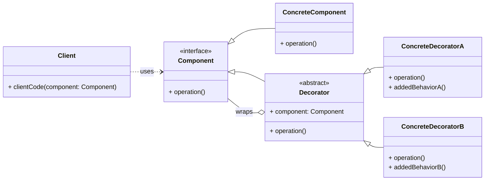

# Cheatsheet: Decorator Pattern

**Category:** Structural

**Problem:** You need to add new functionalities or responsibilities to an object dynamically, without altering its structure or affecting other objects of the same class. Subclassing can lead to a class explosion.

**Solution:** Attach additional responsibilities to an object dynamically. Decorators provide a flexible alternative to subclassing for extending functionality by wrapping the original object.

---

### Structure



---

### Key Components

-   **Component:** Defines the interface for objects that can have responsibilities added to them dynamically (e.g., `Coffee`).
-   **Concrete Component:** The original object to which new responsibilities can be attached (e.g., `SimpleCoffee`).
-   **Decorator:** Maintains a reference to a `Component` object and conforms to the `Component` interface. It acts as an abstract base for concrete decorators (e.g., `CoffeeDecorator`).
-   **Concrete Decorator:** Adds responsibilities to the `Component`. It implements the `Decorator` interface and adds specific behavior (e.g., `Milk`, `Sugar`, `Caramel`).

---

### Python Example (Conceptual)

```python
from abc import ABC, abstractmethod

# Component
class Text(ABC):
    @abstractmethod
    def get_content(self) -> str:
        pass

# Concrete Component
class PlainText(Text):
    def __init__(self, content: str):
        self._content = content

    def get_content(self) -> str:
        return self._content

# Decorator
class TextDecorator(Text, ABC):
    def __init__(self, decorated_text: Text):
        self._decorated_text = decorated_text

    @abstractmethod
    def get_content(self) -> str:
        pass

# Concrete Decorators
class BoldText(TextDecorator):
    def get_content(self) -> str:
        return f"<b>{self._decorated_text.get_content()}</b>"

class ItalicText(TextDecorator):
    def get_content(self) -> str:
        return f"<i>{self._decorated_text.get_content()}</i>"

# Client
if __name__ == "__main__":
    text = PlainText("Hello World")
    print(text.get_content())

    bold_text = BoldText(text)
    print(bold_text.get_content())

    bold_italic_text = ItalicText(BoldText(PlainText("Gemini CLI")))
    print(bold_italic_text.get_content())
```

---

### Pros & Cons

-   **Pros:** Flexible functionality extension, avoids class explosion, adheres to SRP and OCP.
-   **Cons:** Increased complexity (many small classes), debugging challenges, potential order dependency.
