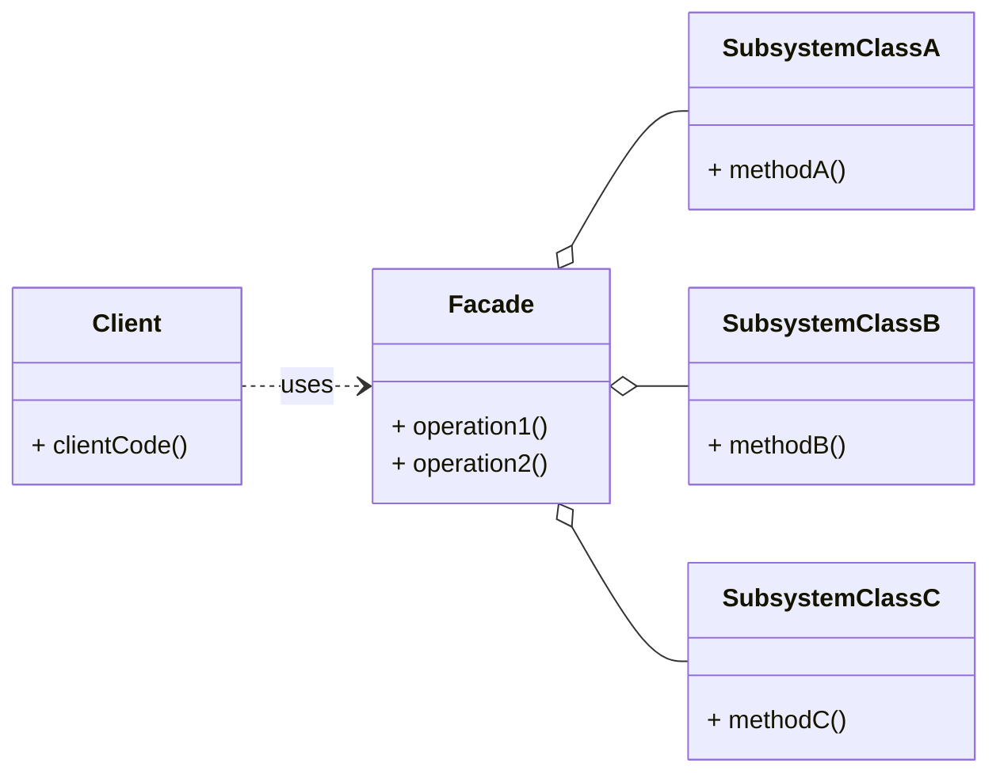

# Cheatsheet: Facade Pattern

**Category:** Structural

**Problem:** A system is composed of a large number of classes or a complex subsystem, making it difficult for clients to interact with it directly due to many dependencies and intricate relationships.

**Solution:** Provide a simplified interface to a complex subsystem. A facade is a single class that provides a simplified, higher-level interface to a set of interfaces in a subsystem, making the subsystem easier to use.

---

### Structure



---

### Key Components

-   **Facade:** Provides a simplified, unified interface to a set of interfaces in the subsystem. It knows which subsystem classes are responsible for a request and delegates client requests to appropriate subsystem objects (e.g., `HomeTheaterFacade`).
-   **Subsystem Classes:** Implement the subsystem's functionality. They do not know about the facade and have no reference to it. They can communicate directly with each other (e.g., `Projector`, `Screen`, `Amplifier`, `DVDPlayer`).
-   **Client:** Uses the `Facade` to interact with the subsystem. It does not directly interact with the complex subsystem classes.

---

### Python Example (Conceptual)

```python
# Subsystem Components
class CPU:
    def freeze(self): return "CPU: Freezing..."
    def jump(self, position): return f"CPU: Jumping to {position}..."
    def execute(self): return "CPU: Executing..."

class Memory:
    def load(self, address, data): return f"Memory: Loading {data} to {address}..."

class HardDrive:
    def read(self, lba, size): return f"HardDrive: Reading {size} bytes from {lba}..."

# Facade
class ComputerFacade:
    def __init__(self):
        self.cpu = CPU()
        self.memory = Memory()
        self.hard_drive = HardDrive()

    def start(self):
        results = []
        results.append(self.cpu.freeze())
        results.append(self.memory.load("0x00", "boot_sector"))
        results.append(self.hard_drive.read("0x00", 1024))
        results.append(self.cpu.jump("0x00"))
        results.append(self.cpu.execute())
        return "\n".join(results)

# Client
if __name__ == "__main__":
    computer = ComputerFacade()
    print(computer.start())
```

---

### Pros & Cons

-   **Pros:** Simplifies client interface, decouples client from subsystem, improves readability and maintainability, increased testability.
-   **Cons:** Can become a "God Object" if too many responsibilities are added, might hide some advanced functionality.
