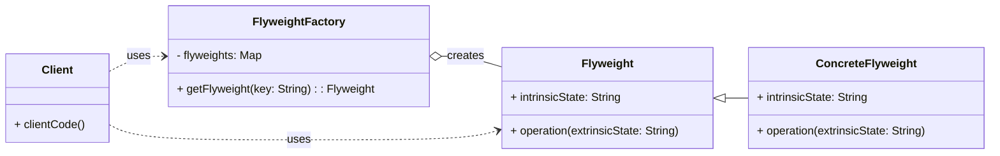

# Cheatsheet: Flyweight Pattern

**Category:** Structural

**Problem:** An application needs to create a large number of objects that are very similar, containing a lot of redundant information, leading to excessive memory consumption.

**Solution:** Minimize memory usage or computation expenses by sharing as much data as possible with other similar objects. It achieves this by separating the intrinsic (shared) state from the extrinsic (unique) state of an object.

---

### Structure



---

### Key Components

-   **Flyweight:** Declares an interface through which flyweights can receive and act on extrinsic state. It stores the intrinsic (shared) state (e.g., `TreeType` with `name`, `color`, `texture`).
-   **Concrete Flyweight:** Implements the `Flyweight` interface and adds storage for intrinsic state. `ConcreteFlyweight` objects must be shareable.
-   **Flyweight Factory:** Creates and manages `Flyweight` objects. It ensures that flyweights are shared properly. When a client requests a flyweight, the factory returns an existing instance or creates a new one if it doesn't exist (e.g., `TreeFactory`).
-   **Client:** Maintains references to flyweights and computes or stores the extrinsic (unique) state of flyweights, passing it to the flyweight methods at runtime (e.g., `Forest` and individual `Tree` objects with `x`, `y` coordinates).

---

### Python Example (Conceptual)

```python
from typing import Dict

# Flyweight
class CharacterProperties:
    def __init__(self, font: str, size: int, color: str):
        self.font = font
        self.size = size
        self.color = color

    def display(self, char: str, x: int, y: int) -> str:
        return f"Char '{char}' at ({x},{y}) with {self.font}, {self.size}, {self.color}"

# Flyweight Factory
class CharacterPropertyFactory:
    _properties: Dict[str, CharacterProperties] = {}

    @staticmethod
    def get_properties(font: str, size: int, color: str) -> CharacterProperties:
        key = f"{font}_{size}_{color}"
        if key not in CharacterPropertyFactory._properties:
            CharacterPropertyFactory._properties[key] = CharacterProperties(font, size, color)
        return CharacterPropertyFactory._properties[key]

# Context (Client-side object)
class Character:
    def __init__(self, char_value: str, x: int, y: int, properties: CharacterProperties):
        self.char_value = char_value
        self.x = x
        self.y = y
        self.properties = properties

    def display(self) -> str:
        return self.properties.display(self.char_value, self.x, self.y)

# Client
if __name__ == "__main__":
    doc_chars = []
    doc_chars.append(Character("H", 0, 0, CharacterPropertyFactory.get_properties("Arial", 12, "Black")))
    doc_chars.append(Character("e", 1, 0, CharacterPropertyFactory.get_properties("Arial", 12, "Black")))
    doc_chars.append(Character("l", 2, 0, CharacterPropertyFactory.get_properties("Arial", 12, "Black")))
    doc_chars.append(Character("l", 3, 0, CharacterPropertyFactory.get_properties("Arial", 12, "Black")))
    doc_chars.append(Character("o", 4, 0, CharacterPropertyFactory.get_properties("Arial", 12, "Black")))
    doc_chars.append(Character("W", 6, 0, CharacterPropertyFactory.get_properties("Times New Roman", 14, "Red")))

    for char_obj in doc_chars:
        print(char_obj.display())

    print(f"Total unique character property objects: {len(CharacterPropertyFactory._properties)}")
```

---

### Pros & Cons

-   **Pros:** Memory optimization (reduces memory consumption), performance improvement (reduces object creation), centralized state management.
-   **Cons:** Increased complexity (more classes, separation of state), potential runtime computation overhead.
