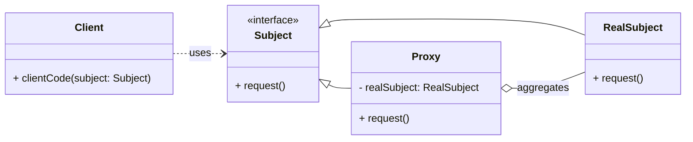

# Cheatsheet: Proxy Pattern

**Category:** Structural

**Problem:** You need to control access to an object, add a layer of indirection, or perform additional actions (like logging, caching, or security checks) before or after accessing the real object.

**Solution:** Provide a surrogate or placeholder for another object to control access to it. A proxy acts as an intermediary, allowing you to add extra behavior when interacting with the real object.

---

### Structure



---

### Key Components

-   **Subject:** Declares the common interface for both `RealSubject` and `Proxy`. This allows the `Proxy` to be used anywhere the `RealSubject` is expected (e.g., `Image`).
-   **Real Subject:** The actual object that the `Proxy` represents. It contains the core business logic (e.g., `RealImage`).
-   **Proxy:** Maintains a reference to the `RealSubject`. It implements the `Subject` interface and controls access to the `RealSubject`. It can perform additional tasks (lazy initialization, access control, logging, caching) before or after forwarding a request to the `RealSubject` (e.g., `ProxyImage`).
-   **Client:** Interacts with the `Subject` interface, unaware of whether it's dealing with a `RealSubject` or a `Proxy`.

---

### Python Example (Conceptual)

```python
from abc import ABC, abstractmethod
import time

# Subject
class DataService(ABC):
    @abstractmethod
    def get_data(self) -> str:
        pass

# Real Subject
class RealDataService(DataService):
    def __init__(self):
        print("RealDataService: Initializing (heavy operation)...")
        time.sleep(1) # Simulate heavy initialization

    def get_data(self) -> str:
        return "Actual Data"

# Proxy
class DataServiceProxy(DataService):
    def __init__(self):
        self._real_service = None

    def get_data(self) -> str:
        if self._real_service is None:
            print("Proxy: Creating RealDataService instance (lazy loading)...")
            self._real_service = RealDataService()
        print("Proxy: Accessing data...")
        return self._real_service.get_data()

# Client
if __name__ == "__main__":
    print("Client: Creating proxy...")
    proxy = DataServiceProxy()
    print("Client: Proxy created. No real service yet.")

    print("Client: First call to get_data (should trigger real service init)...")
    print(proxy.get_data())

    print("Client: Second call to get_data (should use existing real service)...")
    print(proxy.get_data())
```

---

### Pros & Cons

-   **Pros:** Controlled access, lazy loading, security, logging, caching, separation of concerns, transparency to client.
-   **Cons:** Increased complexity, potential performance overhead, can be overused.
