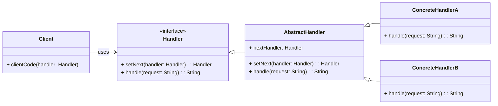

# Cheatsheet: Chain of Responsibility Pattern

**Category:** Behavioral

**Problem:** You have a request that can be handled by one of several objects, and you don't want to explicitly specify which object should handle the request. This often leads to tightly coupled code.

**Solution:** Pass a request along a chain of handlers. Upon receiving a request, each handler decides either to process the request or to pass it to the next handler in the chain.

---

### Structure



---

### Key Components

-   **Handler:** Declares an interface for handling requests. It also defines an interface for setting the next handler in the chain (e.g., `SupportHandler`).
-   **Abstract Handler (Optional):** Provides a base implementation for the `Handler` interface, often including the linking mechanism for the chain (e.g., `AbstractSupportHandler`).
-   **Concrete Handler:** Implements the `handle()` method. It processes the request if it can, otherwise, it forwards the request to its successor (e.g., `Level1Support`, `Level2Support`, `TechnicalLead`).
-   **Client:** Sends requests to the first handler in the chain. It doesn't know which specific handler will process the request.

---

### Python Example (Conceptual)

```python
from abc import ABC, abstractmethod
from typing import Optional

# Handler
class Approver(ABC):
    @abstractmethod
    def set_next(self, approver: 'Approver') -> 'Approver':
        pass

    @abstractmethod
    def approve_loan(self, amount: int) -> Optional[str]:
        pass

# Base Handler
class AbstractApprover(Approver):
    _next_approver: Optional[Approver] = None

    def set_next(self, approver: Approver) -> Approver:
        self._next_approver = approver
        return approver

    def approve_loan(self, amount: int) -> Optional[str]:
        if self._next_approver:
            return self._next_approver.approve_loan(amount)
        return None

# Concrete Handlers
class Manager(AbstractApprover):
    def approve_loan(self, amount: int) -> Optional[str]:
        if amount <= 1000:
            return f"Manager approved loan of ${amount}"
        else:
            return super().approve_loan(amount)

class Director(AbstractApprover):
    def approve_loan(self, amount: int) -> Optional[str]:
        if amount <= 5000:
            return f"Director approved loan of ${amount}"
        else:
            return super().approve_loan(amount)

# Client
if __name__ == "__main__":
    manager = Manager()
    director = Director()
    manager.set_next(director)

    print(manager.approve_loan(500))
    print(manager.approve_loan(3000))
    print(manager.approve_loan(10000))
```

---

### Pros & Cons

-   **Pros:** Loose coupling, flexibility (add/remove handlers dynamically), reduced conditional logic.
-   **Cons:** No guaranteed receipt, debugging can be complex, potential performance overhead.
