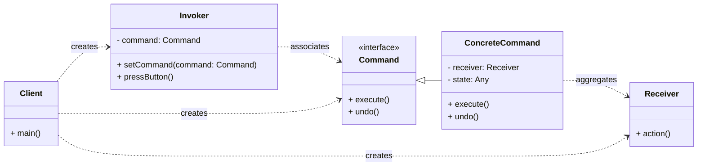

# Cheatsheet: Command Pattern

**Category:** Behavioral

**Problem:** You need to parameterize objects with an operation to perform, queue operations, undo operations, or support logging changes. This often arises when you want to decouple the sender of a request from the object that performs the request.

**Solution:** Turn a request into a stand-alone object that contains all information about the request. This transformation lets you parameterize methods with different requests, delay or queue a request's execution, and support undoable operations.

---

### Structure



---

### Key Components

-   **Command:** Declares an interface for executing an operation. It typically includes an `execute()` method and optionally an `undo()` method (e.g., `Command`).
-   **Concrete Command:** Implements the `Command` interface. It binds a `Receiver` object with an action and its parameters. It might also store the state needed for `undo()` (e.g., `LightOnCommand`, `GarageDoorUpCommand`).
-   **Invoker:** Asks the command to carry out the request. It holds a `Command` object but doesn't know the `Receiver` or the specific action. It simply triggers the command's `execute()` method (e.g., `RemoteControl`).
-   **Receiver:** Knows how to perform the operations associated with carrying out a request. Any class can act as a `Receiver` (e.g., `Light`, `GarageDoor`).
-   **Client:** Creates a `ConcreteCommand` object, sets its `Receiver`, and then associates the `Command` with the `Invoker`.

---

### Python Example (Conceptual)

```python
from abc import ABC, abstractmethod

# Command Interface
class Operation(ABC):
    @abstractmethod
    def execute(self):
        pass

# Receiver
class Calculator:
    def __init__(self):
        self.result = 0

    def add(self, value):
        self.result += value
        return f"Added {value}, Result: {self.result}"

    def subtract(self, value):
        self.result -= value
        return f"Subtracted {value}, Result: {self.result}"

# Concrete Commands
class AddCommand(Operation):
    def __init__(self, calculator: Calculator, value: int):
        self._calculator = calculator
        self._value = value

    def execute(self):
        return self._calculator.add(self._value)

class SubtractCommand(Operation):
    def __init__(self, calculator: Calculator, value: int):
        self._calculator = calculator
        self._value = value

    def execute(self):
        return self._calculator.subtract(self._value)

# Invoker
class UserInterface:
    def __init__(self):
        self._command = None

    def set_command(self, command: Operation):
        self._command = command

    def press_button(self):
        if self._command:
            return self._command.execute()
        return "No command set."

# Client
if __name__ == "__main__":
    calculator = Calculator()
    ui = UserInterface()

    add_cmd = AddCommand(calculator, 10)
    ui.set_command(add_cmd)
    print(ui.press_button())

    subtract_cmd = SubtractCommand(calculator, 5)
    ui.set_command(subtract_cmd)
    print(ui.press_button())
```

---

### Pros & Cons

-   **Pros:** Decoupling (invoker from receiver), supports undo/redo, queueing, logging, and macros, easy to add new commands.
-   **Cons:** Increased complexity (more classes) for simple operations, potential overhead.
