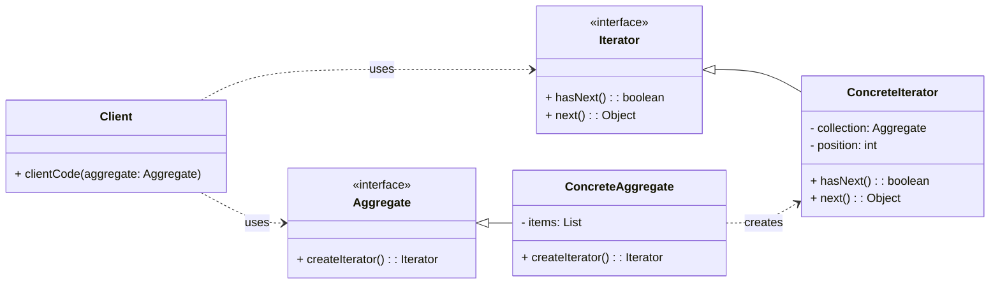

# Cheatsheet: Iterator Pattern

**Category:** Behavioral

**Problem:** You need to access the elements of a collection (like a list, array, or tree) sequentially without exposing its underlying representation. Different collections might have different internal structures.

**Solution:** Provide a way to access the elements of an aggregate object sequentially without exposing its underlying representation. It decouples the traversal logic from the collection object.

---

### Structure



---

### Key Components

-   **Iterator:** Declares an interface for accessing and traversing elements. It typically includes methods like `has_next()` (or `__next__` in Python) and `next()` (or `__next__` in Python) (e.g., `BookIterator`).
-   **Concrete Iterator:** Implements the `Iterator` interface. It keeps track of the current position in the traversal of the aggregate (e.g., `ConcreteBookIterator`).
-   **Aggregate:** Declares an interface for creating an `Iterator` object. It provides a method (e.g., `create_iterator()`) that returns an instance of a `ConcreteIterator` (e.g., `BookCollection`).
-   **Concrete Aggregate:** Implements the `createIterator()` method to return an instance of the appropriate `ConcreteIterator`. It holds the collection of objects (e.g., `Library`).
-   **Client:** Uses the `Iterator` interface to traverse the `Aggregate` without knowing its internal structure.

---

### Pythonic Iterators

In Python, the Iterator pattern is often implemented implicitly using the built-in iterator protocol (`__iter__` and `__next__` methods). A class that implements `__iter__` is an iterable, and `__iter__` should return an iterator object (which implements `__next__`).

```python
from typing import Any, List

class MyCollection:
    def __init__(self, items: List[Any]):
        self._items = items
        self._index = 0

    def __iter__(self):
        # This makes MyCollection itself an iterator (for simplicity)
        # For more complex cases, __iter__ might return a separate iterator object
        self._index = 0 # Reset position for new iteration
        return self

    def __next__(self):
        if self._index < len(self._items):
            item = self._items[self._index]
            self._index += 1
            return item
        else:
            raise StopIteration

# Client Usage
if __name__ == "__main__":
    my_list = MyCollection([1, 2, 3, 4, 5])
    for item in my_list:
        print(item)
```

---

### Pros & Cons

-   **Pros:** Decouples traversal logic from collection, uniform traversal, multiple simultaneous traversals, encapsulates internal representation.
-   **Cons:** Increased complexity for simple collections, potential overhead.
