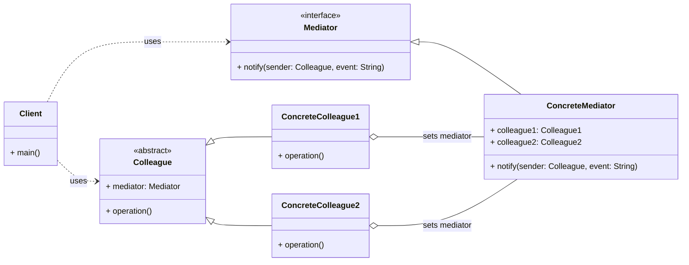

# Cheatsheet: Mediator Pattern

**Category:** Behavioral

**Problem:** When a system has many objects that interact with each other, the direct connections between them can become complex and difficult to manage, leading to tight coupling and "spaghetti code".

**Solution:** Define an object that encapsulates how a set of objects interact. Mediator promotes loose coupling by keeping objects from referring to each other explicitly, and it lets you vary their interaction independently.

---

### Structure



---

### Key Components

-   **Mediator:** Defines an interface for communicating with `Colleague` objects (e.g., `ChatRoomMediator`).
-   **Concrete Mediator:** Implements the `Mediator` interface. It knows and maintains its `Colleagues`. It coordinates `Colleague` objects and handles their communication, centralizing control (e.g., `ChatRoom`).
-   **Colleague:** An abstract class or interface for objects that interact. Each `Colleague` knows its `Mediator` object and communicates with it instead of directly with other `Colleagues` (e.g., `User`).
-   **Concrete Colleague:** Implements the `Colleague` interface. It communicates with its `Mediator` when an event occurs (e.g., `ChatUser`).

---

### Python Example (Conceptual)

```python
from abc import ABC, abstractmethod

# Mediator Interface
class Dialog(ABC):
    @abstractmethod
    def notify(self, sender: 'Widget', event: str):
        pass

# Colleague Abstract Class
class Widget(ABC):
    def __init__(self, dialog: Dialog = None):
        self._dialog = dialog

    def set_dialog(self, dialog: Dialog):
        self._dialog = dialog

# Concrete Colleagues
class Button(Widget):
    def click(self):
        if self._dialog:
            self._dialog.notify(self, "click")

class TextBox(Widget):
    def text_changed(self):
        if self._dialog:
            self._dialog.notify(self, "text_changed")

# Concrete Mediator
class AuthenticationDialog(Dialog):
    def __init__(self):
        self.login_button = Button()
        self.username_textbox = TextBox()
        self.password_textbox = TextBox()

        self.login_button.set_dialog(self)
        self.username_textbox.set_dialog(self)
        self.password_textbox.set_dialog(self)

    def notify(self, sender: Widget, event: str):
        if sender == self.login_button and event == "click":
            print(f"Login button clicked. Username: {self.username_textbox.text}, Password: {self.password_textbox.text}")
        elif sender == self.username_textbox and event == "text_changed":
            print("Username text changed.")

# Client
if __name__ == "__main__":
    dialog = AuthenticationDialog()
    dialog.username_textbox.text = "user123"
    dialog.username_textbox.text_changed()
    dialog.password_textbox.text = "pass"
    dialog.login_button.click()
```

---

### Pros & Cons

-   **Pros:** Loose coupling, centralized control, improved reusability of colleagues, simplifies object protocols.
-   **Cons:** Mediator can become a "God Object" (overly complex), single point of failure, potential performance overhead.
