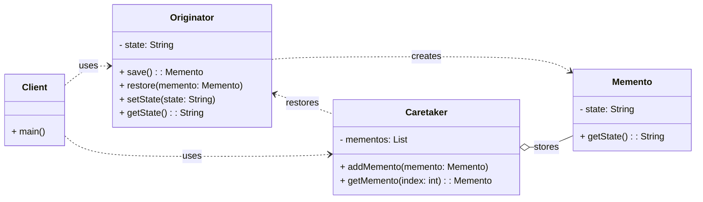

# Cheatsheet: Memento Pattern

**Category:** Behavioral

**Problem:** You need to save and restore the internal state of an object without violating its encapsulation. Directly exposing the object's internal state for saving and restoring would break encapsulation.

**Solution:** Capture and externalize an object's internal state without violating encapsulation, so that the object can be restored to this state later.

---

### Structure



---

### Key Components

-   **Originator:** The object whose state needs to be saved and restored. It creates a `Memento` containing a snapshot of its current state and uses a `Memento` to restore its state (e.g., `TextEditor`).
-   **Memento:** A passive object that stores a snapshot of the `Originator`'s internal state. It should be immutable and have a restricted interface, typically only accessible by the `Originator` and the `Caretaker` (e.g., `EditorMemento`).
-   **Caretaker:** Responsible for keeping track of the `Memento`s. It never operates on or examines the contents of a `Memento`. It simply stores and retrieves them (e.g., `History`).

---

### Python Example (Conceptual)

```python
# Memento
class EditorState:
    def __init__(self, content: str):
        self._content = content

    def get_content(self) -> str:
        return self._content

# Originator
class Editor:
    def __init__(self):
        self._content = ""

    def set_content(self, content: str):
        self._content = content

    def get_content(self) -> str:
        return self._content

    def create_state(self) -> EditorState:
        return EditorState(self._content)

    def restore_state(self, state: EditorState):
        self._content = state.get_content()

# Caretaker
class History:
    def __init__(self):
        self._states = []

    def push(self, state: EditorState):
        self._states.append(state)

    def pop(self) -> EditorState:
        if not self._states:
            raise IndexError("No states to undo.")
        return self._states.pop()

# Client
if __name__ == "__main__":
    editor = Editor()
    history = History()

    editor.set_content("a")
    history.push(editor.create_state())

    editor.set_content("ab")
    history.push(editor.create_state())

    editor.set_content("abc")

    editor.restore_state(history.pop())
    print(editor.get_content()) # ab

    editor.restore_state(history.pop())
    print(editor.get_content()) # a
```

---

### Pros & Cons

-   **Pros:** Encapsulation preservation, ideal for undo/redo, simplifies Originator.
-   **Cons:** Memory consumption, complexity (more classes), performance overhead.
