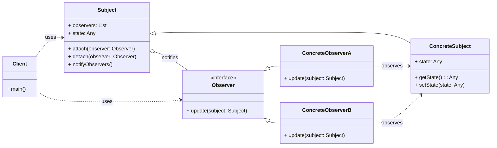

# Cheatsheet: Observer Pattern

**Category:** Behavioral

**Problem:** When an object (the "Subject") changes its state, and other objects (the "Observers") need to be notified and updated automatically. Directly coupling the Subject to all its Observers creates a tight dependency.

**Solution:** Define a one-to-many dependency between objects so that when one object changes state, all its dependents are notified and updated automatically.

---

### Structure



---

### Key Components

-   **Subject (or Observable):** The object that maintains a list of its dependents (observers) and notifies them of state changes. It provides methods for attaching (`register_observer()`) and detaching (`remove_observer()`) observers, and a method to notify all registered observers (`notify_observers()`) (e.g., `WeatherData`).
-   **Concrete Subject:** Implements the `Subject` interface. It stores the state of interest to `ConcreteObserver` objects and sends a notification to its observers when its state changes.
-   **Observer:** Defines an updating interface for objects that should be notified of changes in a subject. It typically has an `update()` method (e.g., `WeatherDisplayObserver`).
-   **Concrete Observer:** Implements the `Observer` updating interface. It registers itself with a `ConcreteSubject` and stores a reference to the `ConcreteSubject`. It updates its state to reflect the subject's state when notified (e.g., `CurrentConditionsDisplay`, `StatisticsDisplay`).

---

### Python Example (Conceptual)

```python
from abc import ABC, abstractmethod
from typing import List

# Subject
class StockSubject(ABC):
    def __init__(self):
        self._observers: List[StockObserver] = []
        self._price: float = 0.0

    def register(self, observer: 'StockObserver'):
        self._observers.append(observer)

    def deregister(self, observer: 'StockObserver'):
        self._observers.remove(observer)

    def notify_all(self):
        for observer in self._observers:
            observer.update(self._price)

    def set_price(self, price: float):
        self._price = price
        self.notify_all()

# Observer
class StockObserver(ABC):
    @abstractmethod
    def update(self, price: float):
        pass

# Concrete Observers
class SMSAlert(StockObserver):
    def update(self, price: float):
        print(f"SMS Alert: Stock price is now {price}")

class EmailAlert(StockObserver):
    def update(self, price: float):
        print(f"Email Alert: Stock price is now {price}")

# Client
if __name__ == "__main__":
    stock = StockSubject()
    sms_alert = SMSAlert()
    email_alert = EmailAlert()

    stock.register(sms_alert)
    stock.register(email_alert)

    stock.set_price(100.50)
    stock.set_price(101.20)

    stock.deregister(sms_alert)
    stock.set_price(102.00)
```

---

### Pros & Cons

-   **Pros:** Loose coupling, extensibility, reusability of observers, broadcast communication.
-   **Cons:** Unexpected updates, debugging challenges, potential performance issues, order of notification not guaranteed.
