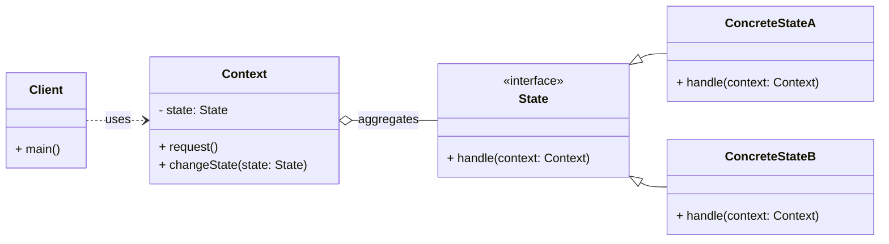

# Cheatsheet: State Pattern

**Category:** Behavioral

**Problem:** An object's behavior changes depending on its internal state, and this behavior is implemented using large, conditional statements (e.g., `if/else` or `switch/case`) that check the object's current state.

**Solution:** Allow an object to alter its behavior when its internal state changes. The object will appear to change its class. This is achieved by creating separate classes for each state, and the original object (Context) delegates its state-dependent behavior to an object of one of these state classes.

---

### Structure



---

### Key Components

-   **Context:** Defines the interface of interest to clients. It maintains an instance of a `ConcreteState` subclass that defines the current state. It delegates state-specific requests to the current `State` object (e.g., `TrafficLight`).
-   **State:** Declares an interface for encapsulating the behavior associated with a particular state of the `Context`. It typically defines methods that correspond to the state-dependent operations of the `Context` (e.g., `TrafficLightState`).
-   **Concrete State:** Each subclass implements a behavior associated with a state of the `Context`. It also handles state transitions, often by calling a method on the `Context` to change its current `State` object (e.g., `RedLightState`, `YellowLightState`, `GreenLightState`).

---

### Python Example (Conceptual)

```python
from abc import ABC, abstractmethod

# State Interface
class OrderState(ABC):
    @abstractmethod
    def process_order(self, order: 'Order'):
        pass

    @abstractmethod
    def ship_order(self, order: 'Order'):
        pass

# Concrete States
class NewOrderState(OrderState):
    def process_order(self, order: 'Order'):
        print("Processing new order.")
        order.set_state(ProcessedOrderState())

    def ship_order(self, order: 'Order'):
        print("Cannot ship a new order. Process it first.")

class ProcessedOrderState(OrderState):
    def process_order(self, order: 'Order'):
        print("Order already processed.")

    def ship_order(self, order: 'Order'):
        print("Shipping processed order.")
        order.set_state(ShippedOrderState())

class ShippedOrderState(OrderState):
    def process_order(self, order: 'Order'):
        print("Order already shipped.")

    def ship_order(self, order: 'Order'):
        print("Order already shipped.")

# Context
class Order:
    def __init__(self):
        self._state: OrderState = NewOrderState()

    def set_state(self, state: OrderState):
        self._state = state

    def process(self):
        self._state.process_order(self)

    def ship(self):
        self._state.ship_order(self)

# Client
if __name__ == "__main__":
    order = Order()
    order.process() # Processing new order.
    order.ship()    # Shipping processed order.
    order.process() # Order already shipped.
```

---

### Pros & Cons

-   **Pros:** Organizes state-specific behavior, simplifies Context code, adheres to Open/Closed Principle, improved testability.
-   **Cons:** Increased number of classes, overhead for simple states.
