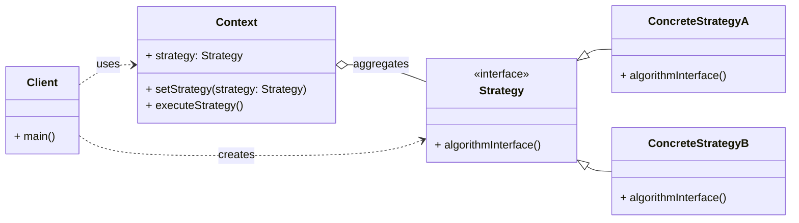

# Cheatsheet: Strategy Pattern

**Category:** Behavioral

**Problem:** You have multiple algorithms or behaviors that can be used interchangeably within a specific context, and you want to select one of them at runtime. Implementing all algorithms directly within the context class leads to a large, complex class and tight coupling.

**Solution:** Define a family of algorithms, encapsulate each one, and make them interchangeable. The Strategy pattern lets the algorithm vary independently from clients that use it.

---

### Structure



---

### Key Components

-   **Context:** The class that uses a `Strategy` object. It maintains a reference to a `Strategy` object and delegates the execution of the algorithm to it. It can be configured with a `ConcreteStrategy` object (e.g., `ShoppingCart`).
-   **Strategy:** An interface (or abstract class) that declares a common interface for all supported algorithms. The `Context` uses this interface to call the algorithm defined by a `ConcreteStrategy` (e.g., `PaymentStrategy`).
-   **Concrete Strategy:** Implements the `Strategy` interface, providing a specific implementation of the algorithm (e.g., `CreditCardPayment`, `PayPalPayment`).

---

### Python Example (Conceptual)

```python
from abc import ABC, abstractmethod

# Strategy Interface
class SortStrategy(ABC):
    @abstractmethod
    def sort(self, data: list) -> list:
        pass

# Concrete Strategies
class BubbleSort(SortStrategy):
    def sort(self, data: list) -> list:
        sorted_data = list(data)
        n = len(sorted_data)
        for i in range(n - 1):
            for j in range(0, n - i - 1):
                if sorted_data[j] > sorted_data[j + 1]:
                    sorted_data[j], sorted_data[j + 1] = sorted_data[j + 1], sorted_data[j]
        return sorted_data

class QuickSort(SortStrategy):
    def sort(self, data: list) -> list:
        # Simplified QuickSort for example
        if len(data) <= 1:
            return data
        pivot = data[len(data) // 2]
        left = [x for x in data if x < pivot]
        middle = [x for x in data if x == pivot]
        right = [x for x in data if x > pivot]
        return self.sort(left) + middle + self.sort(right)

# Context
class DataProcessor:
    def __init__(self, sort_strategy: SortStrategy):
        self._sort_strategy = sort_strategy

    def set_sort_strategy(self, sort_strategy: SortStrategy):
        self._sort_strategy = sort_strategy

    def process_data(self, data: list) -> list:
        print(f"Processing data using {type(self._sort_strategy).__name__}")
        return self._sort_strategy.sort(data)

# Client
if __name__ == "__main__":
    data = [3, 1, 4, 1, 5, 9, 2, 6]

    # Use BubbleSort
    processor = DataProcessor(BubbleSort())
    print(processor.process_data(data))

    # Change to QuickSort at runtime
    processor.set_sort_strategy(QuickSort())
    print(processor.process_data(data))
```

---

### Pros & Cons

-   **Pros:** Interchangeable algorithms, decoupling (context from algorithm), avoids conditional logic, adheres to Open/Closed Principle.
-   **Cons:** Increased number of classes, client must know strategies, potential overhead for simple algorithms.
