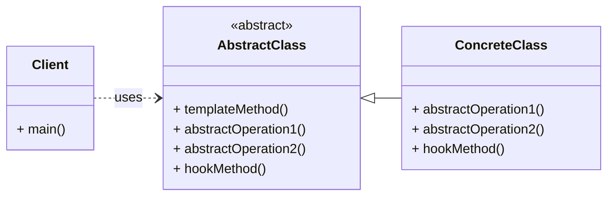

# Cheatsheet: Template Method Pattern

**Category:** Behavioral

**Problem:** You have a common algorithm or process that consists of multiple steps, but some of these steps need to be implemented differently by various subclasses. This can lead to code duplication and inflexibility.

**Solution:** Define the skeleton of an algorithm in an operation, deferring some steps to subclasses. The Template Method lets subclasses redefine certain steps of an algorithm without changing the algorithm's structure.

---

### Structure



---

### Key Components

-   **AbstractClass:** Defines the template method, which is the skeleton of an algorithm. It also defines abstract operations that `ConcreteClass`es must implement, and may define hook operations that `ConcreteClass`es can optionally override (e.g., `CaffeineBeverage`).
-   **ConcreteClass:** Implements the abstract operations to carry out subclass-specific steps of the algorithm. It can also override hook operations to provide additional behavior (e.g., `Coffee`, `Tea`).

---

### Python Example (Conceptual)

```python
from abc import ABC, abstractmethod

# Abstract Class
class Builder(ABC):
    def build(self):
        # Template method defining the build process
        self.start_build()
        self.assemble_parts()
        self.test_product()
        self.finish_build()

    def start_build(self):
        print("Starting build process...")

    def finish_build(self):
        print("Build process finished.")

    @abstractmethod
    def assemble_parts(self):
        pass

    @abstractmethod
    def test_product(self):
        pass

# Concrete Class: CarBuilder
class CarBuilder(Builder):
    def assemble_parts(self):
        print("Assembling car parts: chassis, engine, wheels...")

    def test_product(self):
        print("Testing car: engine start, brakes, lights...")

# Concrete Class: HouseBuilder
class HouseBuilder(Builder):
    def assemble_parts(self):
        print("Assembling house parts: foundation, walls, roof...")

    def test_product(self):
        print("Testing house: plumbing, electricity, insulation...")

# Client
if __name__ == "__main__":
    car_builder = CarBuilder()
    car_builder.build()

    house_builder = HouseBuilder()
    house_builder.build()
```

---

### Pros & Cons

-   **Pros:** Code reusability, inversion of control, enforces algorithm structure, adheres to Open/Closed Principle.
-   **Cons:** Increased complexity for simple algorithms, limited flexibility (fixed algorithm structure), difficulty in changing template.
