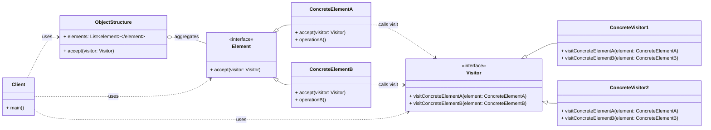

# Cheatsheet: Visitor Pattern

**Category:** Behavioral

**Problem:** You need to perform new operations on objects of an existing object structure (e.g., a tree of different node types) without modifying the classes of those objects. Adding new operations directly to the object classes violates the Open/Closed Principle and scatters code.

**Solution:** Represent an operation to be performed on the elements of an object structure. The Visitor pattern lets you define a new operation without changing the classes of the elements on which it operates.

---

### Structure



---

### Key Components

-   **Visitor:** An interface (or abstract class) that declares a `visit()` method for each concrete element type in the object structure. Each `visit()` method takes a concrete element as an argument (e.g., `DocumentVisitor`).
-   **Concrete Visitor:** Implements the `Visitor` interface, providing a specific implementation for each `visit()` method. Each `ConcreteVisitor` defines a new operation to be performed on the elements (e.g., `HTMLConverter`, `MarkdownConverter`).
-   **Element:** An interface (or abstract class) that defines an `accept()` method. This method takes a `Visitor` object as an argument (e.g., `DocumentElement`).
-   **Concrete Element:** Implements the `Element` interface and its `accept()` method. The `accept()` method typically calls the corresponding `visit()` method on the passed `Visitor` object, passing `self` as an argument (e.g., `Paragraph`, `Heading`).
-   **Object Structure (Optional):** Can enumerate its elements and provide a high-level interface to accept a visitor (e.g., `Document`).

---

### Python Example (Conceptual)

```python
from abc import ABC, abstractmethod
from typing import List

# Element Interface
class Shape(ABC):
    @abstractmethod
    def accept(self, visitor: 'ShapeVisitor'):
        pass

# Concrete Elements
class Circle(Shape):
    def __init__(self, radius: float):
        self.radius = radius

    def accept(self, visitor: 'ShapeVisitor'):
        visitor.visit_circle(self)

class Square(Shape):
    def __init__(self, side: float):
        self.side = side

    def accept(self, visitor: 'ShapeVisitor'):
        visitor.visit_square(self)

# Visitor Interface
class ShapeVisitor(ABC):
    @abstractmethod
    def visit_circle(self, circle: Circle):
        pass

    @abstractmethod
    def visit_square(self, square: Square):
        pass

# Concrete Visitor
class AreaCalculator(ShapeVisitor):
    def __init__(self):
        self.total_area = 0.0

    def visit_circle(self, circle: Circle):
        self.total_area += 3.14159 * circle.radius ** 2

    def visit_square(self, square: Square):
        self.total_area += square.side ** 2

# Object Structure
class Drawing:
    def __init__(self, shapes: List[Shape]):
        self.shapes = shapes

    def accept(self, visitor: ShapeVisitor):
        for shape in self.shapes:
            shape.accept(visitor)

# Client
if __name__ == "__main__":
    drawing = Drawing([
        Circle(5),
        Square(4),
        Circle(2)
    ])

    area_calculator = AreaCalculator()
    drawing.accept(area_calculator)
    print(f"Total Area: {area_calculator.total_area:.2f}")
```

---

### Pros & Cons

-   **Pros:** Separates operations from object structure, adheres to Open/Closed Principle (for operations), centralizes operations, flexibility with complex structures.
-   **Cons:** Increased complexity, hard to add new element types (requires modifying all visitors), can break encapsulation.
