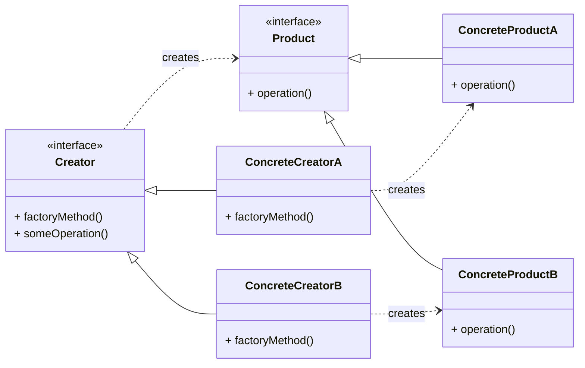

# Creational Pattern: Factory Method

## 1. Problem

Directly instantiating objects within a class can lead to tight coupling. This means that if you need to change the type of object being created, or introduce new types, you have to modify the existing client code. This violates the Open/Closed Principle (OCP).

For example, if you have a `ReportGenerator` class that directly creates `PDFReport` objects, adding `HTMLReport` or `CSVReport` types would require changing the `ReportGenerator`'s code.

## 2. Solution

The **Factory Method** pattern defines an interface (or abstract class) for creating an object, but lets subclasses decide which class to instantiate. The Factory Method defers instantiation to subclasses.

This pattern promotes loose coupling by removing the direct instantiation logic from the client code. The client code works with the abstract `Product` interface and the abstract `Creator` interface, not with concrete classes.

## 3. Structure (UML Conceptual)



-   **Product:** Declares the interface for objects the factory method creates.
-   **ConcreteProduct:** Implements the `Product` interface.
-   **Creator:** Declares the factory method, which returns an object of type `Product`. It may also define a default implementation of the factory method that returns a default `ConcreteProduct`.
-   **ConcreteCreator:** Overrides the factory method to return an instance of a `ConcreteProduct`.

## 4. Python Implementation Example (Notification System)

Let's say you have a notification system that can send emails or SMS messages. You want to add new notification types easily without changing the core sending logic.

```python
from abc import ABC, abstractmethod

# Product Interface
class Notification(ABC):
    @abstractmethod
    def send(self, message: str):
        pass

# Concrete Products
class EmailNotification(Notification):
    def send(self, message: str):
        return f"Sending Email: {message}"

class SMSNotification(Notification):
    def send(self, message: str):
        return f"Sending SMS: {message}"

# Creator Interface
class NotificationCreator(ABC):
    @abstractmethod
    def factory_method(self) -> Notification:
        pass

    def deliver_notification(self, message: str) -> str:
        # This core logic uses the factory method to get a product
        # and then works with the product interface.
        notification = self.factory_method()
        return notification.send(message)

# Concrete Creators
class EmailNotificationCreator(NotificationCreator):
    def factory_method(self) -> Notification:
        return EmailNotification()

class SMSNotificationCreator(NotificationCreator):
    def factory_method(self) -> Notification:
        return SMSNotification()

# Client Code
email_sender = EmailNotificationCreator()
print(email_sender.deliver_notification("Hello via Email!"))

sms_sender = SMSNotificationCreator()
print(sms_sender.deliver_notification("Hello via SMS!"))

# Adding a new notification type (e.g., PushNotification) only requires
# creating PushNotification and PushNotificationCreator classes,
# without modifying existing Creator or client code.
```

## 5. Pros and Cons

### Pros
-   **Loose Coupling:** Decouples the client code from the concrete product classes. The client only depends on the abstract `Product` and `Creator` interfaces.
-   **Single Responsibility Principle:** Moves the product creation code into one place, making it easier to manage.
-   **Open/Closed Principle:** You can introduce new product types without changing existing client code.

### Cons
-   **Increased Complexity:** Introduces more classes (Creator, ConcreteCreator, Product, ConcreteProduct) which can make the code harder to understand initially.
-   **Subclassing Overhead:** Requires subclassing the `Creator` for each new product type.
