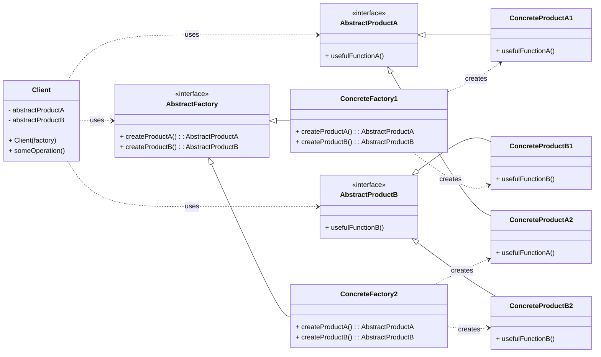

# Creational Pattern: Abstract Factory

## 1. Problem

When an application needs to create families of related or dependent objects without specifying their concrete classes, direct instantiation becomes problematic. This often occurs when you need to support multiple platforms or different configurations, and the client code should not be coupled to the specific implementations of these families.

For example, consider a GUI toolkit that needs to create different types of UI elements (buttons, checkboxes, text fields) for different operating systems (Windows, macOS, Linux). Directly instantiating `WindowsButton`, `MacOSButton`, `LinuxButton` etc., throughout the code would lead to tight coupling and make it difficult to switch themes or add new operating system support.

## 2. Solution

The **Abstract Factory** pattern provides an interface for creating families of related or dependent objects without specifying their concrete classes.

It works by defining an abstract factory interface that declares methods for creating each type of product in the family. Concrete factories then implement this interface, each responsible for creating products for a specific variant. The client code interacts only with the abstract factory and abstract products, allowing it to create entire product families without knowing their concrete implementations.

## 3. Structure (UML Conceptual)



-   **AbstractFactory:** Declares an interface for operations that create abstract product objects.
-   **ConcreteFactory:** Implements the operations to create concrete product objects.
-   **AbstractProduct:** Declares an interface for a type of product object.
-   **ConcreteProduct:** Defines a product object to be created by the corresponding concrete factory and implements the `AbstractProduct` interface.
-   **Client:** Uses interfaces declared by `AbstractFactory` and `AbstractProduct` classes.

## 4. Python Implementation Example (GUI Factory)

Let's create a GUI factory that can produce different sets of UI elements (buttons and checkboxes) for different operating systems.

```python
from abc import ABC, abstractmethod

# Abstract Products
class Button(ABC):
    @abstractmethod
    def paint(self) -> str:
        pass

class Checkbox(ABC):
    @abstractmethod
    def paint(self) -> str:
        pass

# Concrete Products for Windows
class WindowsButton(Button):
    def paint(self) -> str:
        return "Rendering a button in Windows style."

class WindowsCheckbox(Checkbox):
    def paint(self) -> str:
        return "Rendering a checkbox in Windows style."

# Concrete Products for macOS
class MacOSButton(Button):
    def 
    def create_button(self) -> Button:
        return MacOSButton()

    def create_checkbox(self) -> Checkbox:
        return MacOSCheckbox()

# Client Code
def client_application(factory: GUIFactory):
    button = factory.create_button()
    checkbox = factory.create_checkbox()

    print(button.paint())
    print(checkbox.paint())

if __name__ == "__main__":
    print("Client: Testing with Windows factory...")
    client_application(WindowsFactory())

    print("\nClient: Testing with macOS factory...")
    client_application(MacOSFactory())
```

## 5. Pros and Cons

### Pros
-   **Ensures Product Compatibility:** Guarantees that the products created by a factory are compatible with each other.
-   **Isolates Concrete Classes:** Client code is decoupled from concrete product implementations, depending only on abstract interfaces.
-   **Easy to Add New Product Families:** Introducing a new variant (e.g., Linux UI) only requires creating a new concrete factory and its products, without modifying existing client code.

### Cons
-   **Increased Complexity:** Introduces many new interfaces and classes, which can make the codebase more complex, especially if the product families are simple.
-   **Difficult to Add New Product Types:** Adding a new type of product (e.g., a `TextField`) to an existing family requires modifying the `AbstractFactory` interface and all its `ConcreteFactory` implementations, which can be cumbersome.
