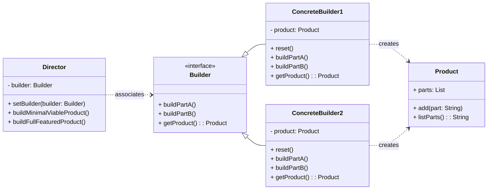

# Creational Pattern: Builder

## 1. Problem

When constructing a complex object, especially one with many optional parts or configurations, the constructor can become overly complex with a large number of parameters. This is often referred to as the "telescoping constructor" anti-pattern. Alternatively, using a series of setter methods can lead to an object being in an inconsistent state until all necessary setters are called.

For example, imagine a `Pizza` class with many possible toppings, crust types, and sizes. A constructor like `Pizza(size, crust, cheese, pepperoni, mushrooms, onions, olives, etc.)` would be unwieldy. Using setters like `pizza.setSize().setCrust().addPepperoni().addMushrooms()` means the `pizza` object is not fully formed until the last setter is called.

## 2. Solution

The **Builder** pattern separates the construction of a complex object from its representation, allowing the same construction process to create different representations.

It involves a `Director` that constructs an object using a `Builder` interface. Different concrete builders provide different implementations of the building steps, resulting in different representations of the product. This allows for a step-by-step construction process where the client can control the final product's configuration without being exposed to its internal construction details.

## 3. Structure (UML Conceptual)



-   **Product:** The complex object under construction. It doesn't require a common interface as different builders can create entirely different products.
-   **Builder:** Declares an abstract interface for creating parts of a Product object. It defines methods for building each component of the product.
-   **ConcreteBuilder:** Implements the `Builder` interface to construct and assemble parts of the product. It provides a specific implementation for each building step and keeps track of the product it's building.
-   **Director:** Constructs an object using the `Builder` interface. It knows the sequence of building steps but not the specific concrete builder or product. It can construct several variations of the product using the same building steps.

## 4. Python Implementation Example (Pizza Builder)

Let's create a Pizza Builder that can construct different types of pizzas (e.g., Margherita, Pepperoni) step-by-step.

```python
from abc import ABC, abstractmethod
from typing import List

# Product: Pizza
class Pizza:
    def __init__(self):
        self.parts = []

    def add(self, part: str):
        self.parts.append(part)

    def list_parts(self) -> str:
        return f"Pizza parts: {', '.join(self.parts)}"

# Builder Interface
class PizzaBuilder(ABC):
    @abstractmethod
    def reset(self):
        pass

    @abstractmethod
    def build_dough(self):
        pass

    @abstractmethod
    def build_sauce(self):
        pass

    @abstractmethod
    def build_topping(self):
        pass

    @abstractmethod
    def get_product(self) -> Pizza:
        pass

# Concrete Builder: Margherita Pizza Builder
class MargheritaPizzaBuilder(PizzaBuilder):
    def __init__(self):
        self.product = Pizza()

    def reset(self):
        self.product = Pizza()

    def build_dough(self):
        self.product.add("thin crust dough")

    def build_sauce(self):
        self.product.add("tomato sauce")

    def build_topping(self):
        self.product.add("mozzarella cheese")
        self.product.add("fresh basil")

    def get_product(self) -> Pizza:
        product = self.product
        self.reset()
        return product

# Concrete Builder: Pepperoni Pizza Builder
class PepperoniPizzaBuilder(PizzaBuilder):
    def __init__(self):
        self.product = Pizza()

    def reset(self):
        self.product = Pizza()

    def build_dough(self):
        self.product.add("thick crust dough")

    def build_sauce(self):
        self.product.add("spicy tomato sauce")

    def build_topping(self):
        self.product.add("mozzarella cheese")
        self.product.add("pepperoni slices")
        self.product.add("oregano")

    def get_product(self) -> Pizza:
        product = self.product
        self.reset()
        return product

# Director
class PizzaDirector:
    def __init__(self, builder: PizzaBuilder):
        self._builder = builder

    def set_builder(self, builder: PizzaBuilder):
        self._builder = builder

    def build_margherita_pizza(self):
        self._builder.reset()
        self._builder.build_dough()
        self._builder.build_sauce()
        self._builder.build_topping()

    def build_pepperoni_pizza(self):
        self._builder.reset()
        self._builder.build_dough()
        self._builder.build_sauce()
        self._builder.build_topping()

# Client Code
if __name__ == "__main__":
    margherita_builder = MargheritaPizzaBuilder()
    director = PizzaDirector(margherita_builder)
    director.build_margherita_pizza()
    margherita_pizza = margherita_builder.get_product()
    print(margherita_pizza.list_parts())

    pepperoni_builder = PepperoniPizzaBuilder()
    director.set_builder(pepperoni_builder)
    director.build_pepperoni_pizza()
    pepperoni_pizza = pepperoni_builder.get_product()
    print(pepperoni_pizza.list_parts())

    # Custom pizza without a director
    custom_pizza_builder = MargheritaPizzaBuilder() # Can reuse any builder
    custom_pizza_builder.reset()
    custom_pizza_builder.build_dough()
    custom_pizza_builder.build_sauce()
    custom_pizza_builder.product.add("extra cheese")
    custom_pizza_builder.product.add("olives")
    custom_pizza = custom_pizza_builder.get_product()
    print(custom_pizza.list_parts())
```

## 5. Pros and Cons

### Pros
-   **Step-by-step Construction:** Allows you to construct objects step-by-step, deferring construction steps or running steps recursively.
-   **Separation of Concerns:** Separates the construction logic from the product's representation.
-   **Reusable Construction Code:** The same building process can create different representations of the product.
-   **Control over Product Complexity:** You can make the construction process more granular, allowing for fine-grained control over the product's features.

### Cons
-   **Increased Complexity:** Introduces several new classes (Builder, ConcreteBuilder, Director, Product), which can make the code more complex than a simple constructor, especially for simpler objects.
-   **Mutable Product:** The product might not be fully formed until the very end of the construction process, which can lead to inconsistent states if not handled carefully.
