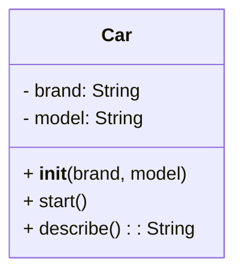
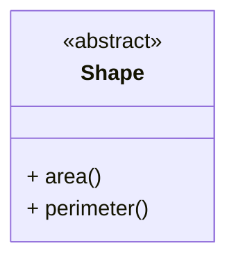
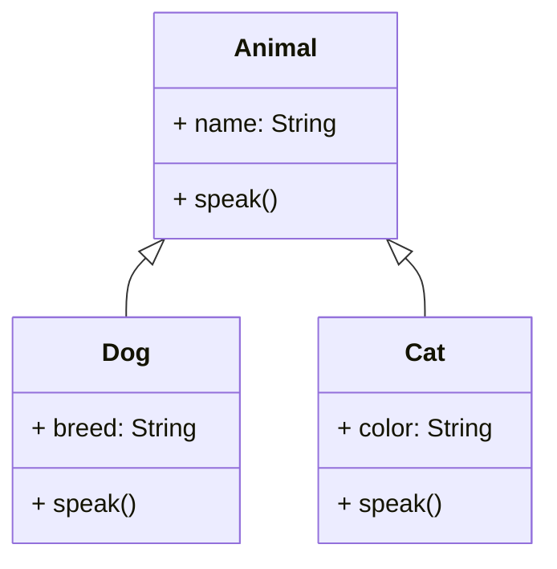
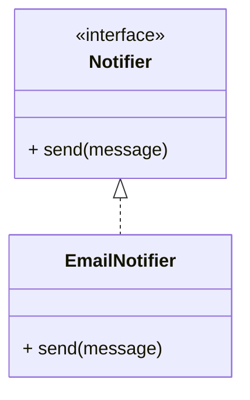
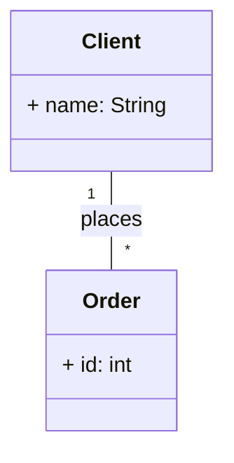
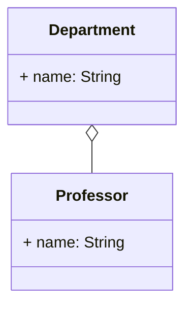
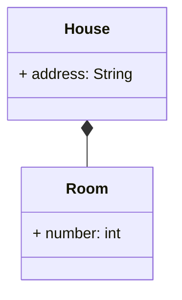
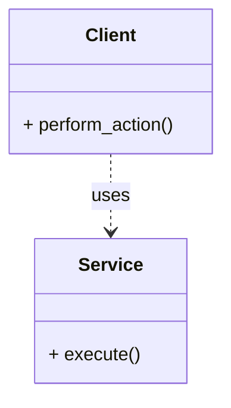

# UML Class Diagrams

UML (Unified Modeling Language) Class Diagrams are a standard visual tool in software development for modeling the static structure of a system. They are crucial for understanding and communicating design patterns, as they provide a clear representation of classes, their attributes, methods, and the relationships between them.

## 1. Basic Elements of a Class Diagram

### 1.1. Classes

Represent blueprints for objects. They are drawn as a rectangle divided into three sections:

-   **Top Section:** Class Name.
-   **Middle Section:** Attributes (instance variables).
-   **Bottom Section:** Methods (functions).

**Member Visibility:**

-   `+` (Public): Accessible from anywhere.
-   `-` (Private): Accessible only from within the class itself.
-   `#` (Protected): Accessible from within the class itself and its subclasses.

**Example:**



### 1.2. Abstract Classes

An abstract class cannot be instantiated directly and may contain abstract methods. In UML, it is represented with the class name and/or abstract methods in *italics*.

**Example:**



### 1.3. Interfaces

In UML, an interface defines a set of operations that a class must implement. It is represented in two ways:

-   As a class with the `<<interface>>` stereotype.
-   As a small circle with the interface name (lollipop notation).

**Example:**

```mermaid
classDiagram
    class Notifier {
        <<interface>>
        + send(message)
    }

    # Or with lollipop notation
    # interface Notifier
    # Notifier <|.. EmailNotifier
```

## 2. Relationships Between Classes

Relationships are the heart of class diagrams, showing how classes interact with each other.

### 2.1. Inheritance (Generalization)

Represents an "is-a" relationship, where a subclass inherits from a superclass. It is drawn as a solid line with a hollow triangular arrowhead pointing to the superclass.

**Example:**



### 2.2. Implementation (Realization)

Represents that a class implements an interface. It is drawn as a dashed line with a hollow triangular arrowhead pointing to the interface.

**Example:**



### 2.3. Association

Represents a structural relationship where objects of one class are connected to objects of another class. It can have multiplicity (how many objects of one class relate to how many of another).

-   `1`: Exactly one.
-   `0..1`: Zero or one.
-   `1..*`: One or many.
-   `*`: Zero or many.

**Example:**



### 2.4. Aggregation

A special type of association that represents a "has-a" relationship where one class is a "whole" and the other is a "part," but the part can exist independently of the whole. It is drawn as a line with a hollow diamond arrowhead on the "whole" side.

**Example:**



### 2.5. Composition

A special type of aggregation that represents a "has-a" relationship where the part cannot exist independently of the whole. If the whole is destroyed, the part is also destroyed. It is drawn as a line with a filled diamond arrowhead on the "whole" side.

**Example:**



### 2.6. Dependency

Represents that one class uses or depends on another class, usually at the method level (e.g., one class uses another as a method parameter). It is a short-term usage relationship. It is drawn as a dashed line with an open arrowhead.

**Example:**



## Conclusion

UML Class Diagrams are an invaluable tool for visualizing software architecture and understanding how design patterns structure relationships between classes. Practicing reading and creating these diagrams will significantly improve your ability to design and communicate software solutions.