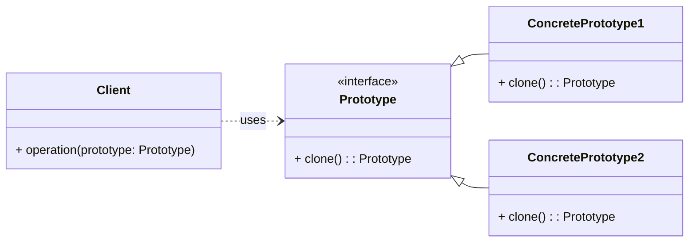

# Creational Pattern: Prototype

## 1. Problem

Creating new objects directly can be inefficient or complex, especially when the object's creation process involves heavy resource allocation (like database queries, network calls, or complex computations) or when the object's type is determined at runtime. Directly instantiating objects with `new` (or direct constructor calls in Python) couples the client code to the concrete classes, making it less flexible.

For example, if you have a `Document` object that needs to be duplicated frequently, and its creation involves loading large amounts of data, creating a new one from scratch every time is inefficient. Also, if you need to create copies of an object whose exact type is not known until runtime, you cannot use a direct constructor call.

## 2. Solution

The **Prototype** pattern specifies the kinds of objects to create using a prototypical instance, and creates new objects by copying this prototype.

This pattern involves a `Prototype` interface (or abstract class) with a `clone()` method. Concrete prototype classes implement this method to return a copy of themselves. The client code then creates new objects by asking a prototype to clone itself, without knowing the concrete class of the prototype.

## 3. Structure (UML Conceptual)



-   **Prototype:** Declares an interface for cloning itself.
-   **ConcretePrototype:** Implements the `clone()` operation to create a copy of itself.
-   **Client:** Creates a new object by asking a prototype to clone itself.

## 4. Python Implementation Example (Document Prototype)

Let's create a `Document` prototype that can be cloned to create new documents efficiently.

```python
import copy
from abc import ABC, abstractmethod

# Prototype Interface
class Document(ABC):
    def __init__(self, name: str):
        self.name = name

    @abstractmethod
    def clone(self):
        pass

    def __str__(self):
        return f"Document: {self.name}"

# Concrete Prototype
class Report(Document):
    def __init__(self, name: str, content: str, author: str):
        super().__init__(name)
        self.content = content
        self.author = author

    def clone(self):
        # Perform a deep copy to ensure mutable attributes are also copied
        return copy.deepcopy(self)

    def __str__(self):
        return f"Report: {self.name}, Author: {self.author}, Content: {self.content[:20]}..."

# Concrete Prototype
class Presentation(Document):
    def __init__(self, name: str, slides: list, presenter: str):
        super().__init__(name)
        self.slides = slides
        self.presenter = presenter

    def clone(self):
        # Perform a deep copy to ensure mutable attributes are also copied
        return copy.deepcopy(self)

    def __str__(self):
        return f"Presentation: {self.name}, Slides: {len(self.slides)}, Presenter: {self.presenter}"

# Client Code
if __name__ == "__main__":
    # Create a prototype report
    original_report = Report("Annual Sales", "Detailed sales figures for Q1-Q4...", "Alice Smith")
    print(f"Original Report: {original_report}")

    # Clone the report to create a new one
    cloned_report = original_report.clone()
    cloned_report.name = "Q1 Sales Summary"
    cloned_report.author = "Bob Johnson"
    print(f"Cloned Report: {cloned_report}")
    print(f"Original Report (after clone modification): {original_report}") # Original remains unchanged

    print("\n" + "-"*30 + "\n")

    # Create a prototype presentation
    original_presentation = Presentation("Project Alpha", ["Intro", "Data", "Conclusion"], "Charlie Brown")
    print(f"Original Presentation: {original_presentation}")

    # Clone the presentation
    cloned_presentation = original_presentation.clone()
    cloned_presentation.name = "Project Beta"
    cloned_presentation.slides.append("New Slide")
    cloned_presentation.presenter = "Diana Prince"
    print(f"Cloned Presentation: {cloned_presentation}")
    print(f"Original Presentation (after clone modification): {original_presentation}") # Original remains unchanged
```

## 5. Pros and Cons

### Pros
-   **Efficient Object Creation:** Creating objects by cloning an existing instance can be more efficient than creating them from scratch, especially for complex objects.
-   **Decoupling:** Decouples the client from the concrete classes of objects being created. The client only needs to know the `Prototype` interface.
-   **Dynamic Object Creation:** Allows for creating new objects at runtime without knowing their specific types, as long as they implement the `clone()` method.
-   **Reduced Subclassing:** Avoids the need for parallel class hierarchies (like in Abstract Factory) when dealing with different product variants.

### Cons
-   **Complex Cloning Logic:** Implementing the `clone()` operation can be complicated, especially if the objects have circular references or complex internal structures (deep copy vs. shallow copy considerations).
-   **Not Always Applicable:** Not suitable for objects that do not support copying or whose internal state is difficult to clone.
