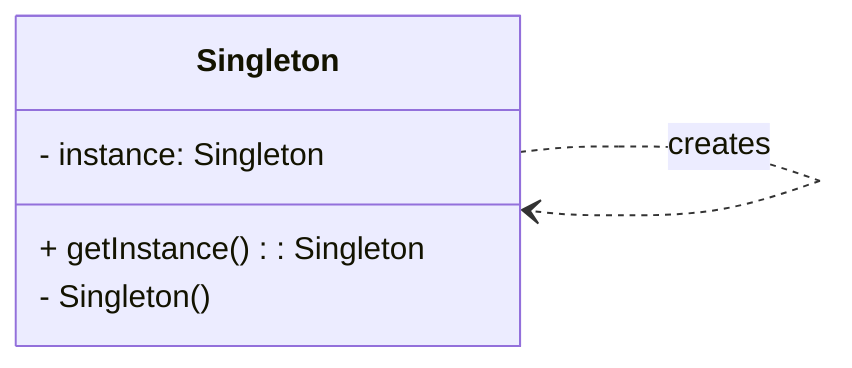

# Creational Pattern: Singleton

## 1. Problem

Sometimes, you need to ensure that a class has only one instance and provide a global point of access to that instance. This is common for objects that manage shared resources (like a database connection pool, a logger, or configuration settings) or for services that should be unique within an application.

Directly instantiating such a class multiple times can lead to resource conflicts, inconsistent states, or unnecessary overhead. For example, having multiple logger instances writing to the same file could lead to corrupted logs or race conditions.

## 2. Solution

The **Singleton** pattern ensures that a class has only one instance and provides a global point of access to that instance.

There are several ways to implement the Singleton pattern in Python, but a common approach involves overriding the `__new__` method to control object creation or using a metaclass. The key is to ensure that subsequent attempts to create an instance of the class return the same, single instance.

## 3. Structure (UML Conceptual)



-   **Singleton:** Defines an `getInstance` operation that lets clients access its unique instance. `getInstance` is responsible for creating its own unique instance.

## 4. Python Implementation Example (Logger Singleton)

Let's create a `Logger` class that ensures only one instance exists throughout the application.

```python
class Logger:
    _instance = None

    def __new__(cls):
        if cls._instance is None:
            cls._instance = super(Logger, cls).__new__(cls)
            # Put any initialization here.
            cls._instance.log_messages = []
            print("Logger instance created!")
        return cls._instance

    def log(self, message):
        self.log_messages.append(message)
        print(f"LOG: {message}")

    def get_logs(self):
        return self.log_messages

# Client Code
if __name__ == "__main__":
    logger1 = Logger()
    logger1.log("First message.")

    logger2 = Logger()
    logger2.log("Second message.")

    print(f"Are logger1 and logger2 the same instance? {logger1 is logger2}")
    print(f"All logs from logger1: {logger1.get_logs()}")
    print(f"All logs from logger2: {logger2.get_logs()}")

    # Another way to ensure singleton (using a decorator)
    def singleton(cls):
        instances = {}
        def get_instance(*args, **kwargs):
            if cls not in instances:
                instances[cls] = cls(*args, **kwargs)
            return instances[cls]
        return get_instance

    @singleton
    class DatabaseConnection:
        def __init__(self):
            print("Database connection initialized!")
            self.connection = "DB_CONNECTION_OBJECT"

        def query(self, sql):
            return f"Executing query: {sql} using {self.connection}"

    db1 = DatabaseConnection()
    db2 = DatabaseConnection()

    print(f"Are db1 and db2 the same instance? {db1 is db2}")
    print(db1.query("SELECT * FROM users"))
```

## 5. Pros and Cons

### Pros
-   **Ensures Single Instance:** Guarantees that a class has only one instance.
-   **Global Access Point:** Provides a well-known global access point to that instance.
-   **Controlled Instantiation:** Allows for lazy initialization and controlled access to the instance.
-   **Resource Management:** Useful for managing shared resources like database connections, file systems, or configuration objects.

### Cons
-   **Violates Single Responsibility Principle:** The class is responsible for both its normal behavior and ensuring its singleton status.
-   **Can Hide Bad Design:** Overuse can lead to tightly coupled code and make testing difficult, as it introduces global state.
-   **Testing Challenges:** Difficult to test, as it's hard to mock or replace the singleton instance in unit tests.
-   **Concurrency Issues:** In multi-threaded environments, special care must be taken to ensure thread-safety during instantiation.
