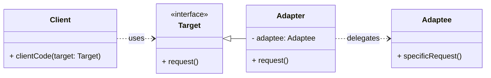

# Structural Pattern: Adapter

## 1. Problem

Sometimes, you have existing classes with incompatible interfaces, and you need them to work together. You cannot modify the source code of these classes (e.g., they are from a third-party library), or it's impractical to do so. This incompatibility prevents direct communication and reuse.

For example, imagine you have a media player application that only supports playing MP3 files. Now, you want to add support for playing WAV and OGG files, but the existing playback libraries for WAV and OGG have different interfaces than your MP3 player.

## 2. Solution

The **Adapter** pattern converts the interface of a class into another interface clients expect. Adapter lets classes work together that couldn't otherwise because of incompatible interfaces.

It involves creating an `Adapter` class that acts as a wrapper around the incompatible object. The adapter translates calls from the client's interface into calls that the wrapped object can understand. This allows the client to interact with the incompatible object through a familiar interface.

## 3. Structure (UML Conceptual)



-   **Target:** Defines the domain-specific interface that `Client` uses.
-   **Adaptee:** Defines an existing interface that needs adapting. This is the incompatible class.
-   **Adapter:** Implements the `Target` interface and holds an instance of the `Adaptee`. It translates requests from `Target` to `Adaptee`.
-   **Client:** Collaborates with objects conforming to the `Target` interface.

## 4. Python Implementation Example (Media Player Adapter)

Let's adapt a `WAVPlayer` and `OGGPlayer` to work with a generic `MediaPlayer` interface.

```python
from abc import ABC, abstractmethod

# Target Interface
class MediaPlayer(ABC):
    @abstractmethod
    def play(self, filename: str):
        pass

# Adaptee 1: Incompatible WAV Player
class WAVPlayer:
    def play_wav(self, file_path: str):
        return f"Playing WAV file: {file_path}"

# Adaptee 2: Incompatible OGG Player
class OGGPlayer:
    def play_ogg_file(self, path: str):
        return f"Playing OGG file: {path}"

# Adapter for WAVPlayer
class WAVPlayerAdapter(MediaPlayer):
    def __init__(self, wav_player: WAVPlayer):
        self._wav_player = wav_player

    def play(self, filename: str):
        return self._wav_player.play_wav(filename)

# Adapter for OGGPlayer
class OGGPlayerAdapter(MediaPlayer):
    def __init__(self, ogg_player: OGGPlayer):
        self._ogg_player = ogg_player

    def play(self, filename: str):
        return self._ogg_player.play_ogg_file(filename)

# Client Code
def client_code(player: MediaPlayer, file: str):
    print(player.play(file))

if __name__ == "__main__":
    print("Client: Playing MP3 (direct implementation - not shown, but assumed compatible)")
    # Assume a direct MP3 player exists that implements MediaPlayer
    # mp3_player = MP3Player()
    # client_code(mp3_player, "song.mp3")

    print("\nClient: Playing WAV via Adapter")
    wav_player = WAVPlayer()
    wav_adapter = WAVPlayerAdapter(wav_player)
    client_code(wav_adapter, "audio.wav")

    print("\nClient: Playing OGG via Adapter")
    ogg_player = OGGPlayer()
    ogg_adapter = OGGPlayerAdapter(ogg_player)
    client_code(ogg_adapter, "music.ogg")
```

## 5. Pros and Cons

### Pros
-   **Reusability:** Allows existing classes to work with new clients without modifying their source code.
-   **Flexibility:** Promotes loose coupling between the client and the adaptee.
-   **Transparency:** The client doesn't need to know that an adapter is being used.
-   **Single Responsibility Principle:** Separates the interface translation logic into a dedicated adapter class.

### Cons
-   **Increased Complexity:** Introduces a new class (the adapter) which can add complexity, especially if many adapters are needed.
-   **Overhead:** There might be a slight performance overhead due to the extra layer of indirection.

```