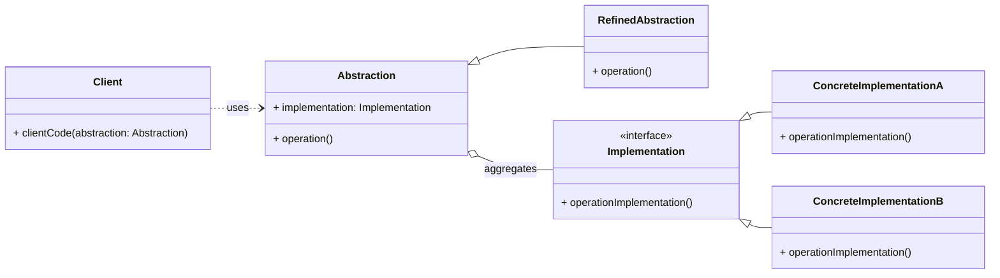

# Structural Pattern: Bridge

## 1. Problem

When you have a class hierarchy (e.g., `Shape`) and you also need to vary its implementation (e.g., how it's drawn on different rendering APIs like OpenGL, DirectX, or SVG), you might end up with a complex, unmanageable class explosion. This happens if you try to extend the `Shape` hierarchy with drawing implementations directly (ee.g., `CircleOpenGL`, `CircleDirectX`, `SquareOpenGL`, `SquareDirectX`).

This tight coupling between the abstraction (what the object is) and its implementation (how it does what it does) makes the system rigid. Changes to one dimension (e.g., adding a new shape) require changes in the other (e.g., adding drawing logic for all rendering APIs), and vice-versa.

## 2. Solution

The **Bridge** pattern decouples an abstraction from its implementation so that the two can vary independently.

It achieves this by separating a class into two distinct hierarchies: an `Abstraction` hierarchy and an `Implementation` hierarchy. The `Abstraction` contains a reference to an object from the `Implementation` hierarchy. Clients interact with the `Abstraction`, which then delegates the actual work to the `Implementation` object. This allows both hierarchies to evolve independently without affecting each other.

## 3. Structure (UML Conceptual)



-   **Abstraction:** Defines the abstraction's interface. It maintains a reference to an object of type `Implementation`.
-   **RefinedAbstraction:** Extends the `Abstraction` interface.
-   **Implementation:** Declares the interface for implementation classes. It doesn't have to correspond exactly to `Abstraction`'s interface; in fact, the two interfaces can be quite different.
-   **ConcreteImplementation:** Implements the `Implementation` interface.

## 4. Python Implementation Example (Remote Control)

Let's use the Bridge pattern to control different types of devices (TV, Radio) using different remote controls (Basic, Advanced).

```python
from abc import ABC, abstractmethod

# Implementation Interface
class Device(ABC):
    @abstractmethod
    def is_enabled(self) -> bool:
        pass

    @abstractmethod
    def enable(self):
        pass

    @abstractmethod
    def disable(self):
        pass

    @abstractmethod
    def get_volume(self) -> int:
        pass

    @abstractmethod
    def set_volume(self, percent: int):
        pass

    @abstractmethod
    def get_channel(self) -> int:
        pass

    @abstractmethod
    def set_channel(self, channel: int):
        pass

# Concrete Implementations
class TV(Device):
    def __init__(self):
        self._enabled = False
        self._volume = 30
        self._channel = 1

    def is_enabled(self) -> bool:
        return self._enabled

    def enable(self):
        self._enabled = True
        return "TV: ON"

    def disable(self):
        self._enabled = False
        return "TV: OFF"

    def get_volume(self) -> int:
        return self._volume

    def set_volume(self, percent: int):
        if 0 <= percent <= 100:
            self._volume = percent
            return f"TV: Volume set to {self._volume}"
        return "TV: Invalid volume."

    def get_channel(self) -> int:
        return self._channel

    def set_channel(self, channel: int):
        self._channel = channel
        return f"TV: Channel set to {self._channel}"

class Radio(Device):
    def __init__(self):
        self._enabled = False
        self._volume = 50
        self._channel = 99

    def is_enabled(self) -> bool:
        return self._enabled

    def enable(self):
        self._enabled = True
        return "Radio: ON"

    def disable(self):
        self._enabled = False
        return "Radio: OFF"

    def get_volume(self) -> int:
        return self._volume

    def set_volume(self, percent: int):
        if 0 <= percent <= 100:
            self._volume = percent
            return f"Radio: Volume set to {self._volume}"
        return "Radio: Invalid volume."

    def get_channel(self) -> int:
        return self._channel

    def set_channel(self, channel: int):
        self._channel = channel
        return f"Radio: Channel set to {self._channel}"

# Abstraction
class RemoteControl(ABC):
    def __init__(self, device: Device):
        self._device = device

    def toggle_power(self):
        if self._device.is_enabled():
            return self._device.disable()
        else:
            return self._device.enable()

    def volume_up(self):
        return self._device.set_volume(self._device.get_volume() + 10)

    def volume_down(self):
        return self._device.set_volume(self._device.get_volume() - 10)

    def channel_up(self):
        return self._device.set_channel(self._device.get_channel() + 1)

    def channel_down(self):
        return self._device.set_channel(self._device.get_channel() - 1)

# Refined Abstraction
class AdvancedRemoteControl(RemoteControl):
    def mute(self):
        return self._device.set_volume(0)

# Client Code
if __name__ == "__main__":

    tv = TV()
    radio = Radio()

    print("Basic Remote with TV:")
    basic_remote_tv = RemoteControl(tv)
    print(basic_remote_tv.toggle_power())
    print(basic_remote_tv.volume_up())
    print(basic_remote_tv.channel_up())
    print(basic_remote_tv.toggle_power())

    print("\nAdvanced Remote with Radio:")
    advanced_remote_radio = AdvancedRemoteControl(radio)
    print(advanced_remote_radio.toggle_power())
    print(advanced_remote_radio.volume_up())
    print(advanced_remote_radio.channel_up())
    print(advanced_remote_radio.mute())
    print(advanced_remote_radio.toggle_power())
```

## 5. Pros and Cons

### Pros
-   **Decoupling:** Decouples the abstraction from its implementation, allowing them to vary independently.
-   **Extensibility:** You can extend both the abstraction and implementation hierarchies independently.
-   **Improved Maintainability:** Changes in one hierarchy don't affect the other.
-   **Hides Implementation Details:** Clients only interact with the abstraction, unaware of the underlying implementation.

### Cons
-   **Increased Complexity:** Introduces more classes and interfaces, which can make the initial design more complex.
-   **Initial Design Effort:** Requires careful planning to define the abstraction and implementation interfaces correctly.
