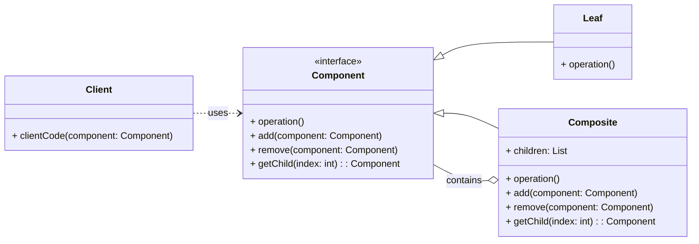

# Structural Pattern: Composite

## 1. Problem

When you need to treat individual objects and compositions of objects uniformly, it can become challenging. If your code has to distinguish between a single object and a group of objects, it becomes more complex and harder to maintain. This often happens when dealing with tree-like structures where both individual nodes (leaves) and branches (composites) need to be handled in a similar manner.

For example, in a graphical editor, you might have individual shapes (circles, squares) and groups of shapes. If you want to move or resize any of these, you'd ideally want to apply the same operation regardless of whether it's a single shape or a group. Without the Composite pattern, you'd need conditional logic to check the type of object and apply the operation differently.

## 2. Solution

The **Composite** pattern composes objects into tree structures to represent part-whole hierarchies. Composite lets clients treat individual objects and compositions of objects uniformly.

It achieves this by defining a common interface for both individual objects (leaves) and composite objects (which can contain other leaves or composites). The client interacts with this common interface, and the composite objects delegate operations to their children. This allows clients to work with complex hierarchies as if they were simple, individual objects.

## 3. Structure (UML Conceptual)



-   **Component:** Declares the interface for objects in the composition. It implements default behavior for the interface common to all classes, and declares an interface for accessing and managing its child components.
-   **Leaf:** Represents leaf objects in the composition. A leaf has no children.
-   **Composite:** Defines behavior for components having children. It stores child components and implements child-related operations in the `Component` interface.
-   **Client:** Manipulates objects in the composition through the `Component` interface.

## 4. Python Implementation Example (File System)

Let's model a file system where both individual files and directories (which contain files or other directories) can be treated uniformly.

```python
from abc import ABC, abstractmethod
from typing import List

# Component Interface
class FileSystemComponent(ABC):
    def __init__(self, name: str):
        self.name = name

    @abstractmethod
    def display(self, indent: int = 0):
        pass

    def add(self, component: 'FileSystemComponent'):
        raise NotImplementedError("Cannot add component to a Leaf.")

    def remove(self, component: 'FileSystemComponent'):
        raise NotImplementedError("Cannot remove component from a Leaf.")

# Leaf
class File(FileSystemComponent):
    def __init__(self, name: str, size: int):
        super().__init__(name)
        self.size = size

    def display(self, indent: int = 0):
        print('  ' * indent + f"- File: {self.name} ({self.size}KB)")

# Composite
class Directory(FileSystemComponent):
    def __init__(self, name: str):
        super().__init__(name)
        self.children: List[FileSystemComponent] = []

    def add(self, component: FileSystemComponent):
        self.children.append(component)

    def remove(self, component: FileSystemComponent):
        self.children.remove(component)

    def display(self, indent: int = 0):
        print('  ' * indent + f"- Directory: {self.name}/")
        for child in self.children:
            child.display(indent + 1)

# Client Code
if __name__ == "__main__":
    # Create files
    file1 = File("document.txt", 100)
    file2 = File("image.jpg", 500)
    file3 = File("report.pdf", 200)

    # Create directories
    root = Directory("root")
    documents = Directory("documents")
    photos = Directory("photos")

    # Build the hierarchy
    root.add(documents)
    root.add(photos)
    root.add(file1)

    documents.add(file3)

    photos.add(file2)
    photos.add(File("vacation.png", 1200))

    # Display the file system structure
    print("File System Structure:")
    root.display()

    print("\nRemoving report.pdf...")
    documents.remove(file3)
    root.display()

    print("\nAdding new_file.txt to root...")
    root.add(File("new_file.txt", 50))
    root.display()
```

## 5. Pros and Cons

### Pros
-   **Uniformity:** Clients can treat individual objects and compositions of objects uniformly, simplifying client code.
-   **Flexibility:** Makes it easy to add new types of components (leaves or composites) without changing existing client code.
-   **Tree Structures:** Ideal for representing part-whole hierarchies.

### Cons
-   **Over-generalization:** Can make it difficult to restrict the types of components that can be added to a composite, as the `Component` interface must be general enough for both leaves and composites.
-   **Runtime Checks:** Sometimes, you might need runtime checks to determine if a component is a leaf or a composite, which can slightly complicate code.
