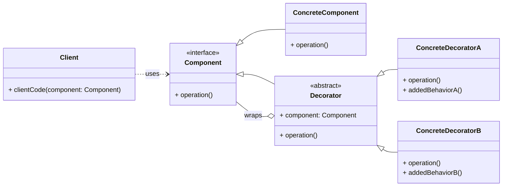

# Structural Pattern: Decorator

## 1. Problem

When you need to add new functionalities or responsibilities to an object dynamically, without altering its structure or affecting other objects of the same class. Subclassing can lead to a class explosion if there are many combinations of features, and static composition (e.g., passing objects to a constructor) can be inflexible.

For example, imagine a coffee shop system where you have a `Coffee` object. You want to add various condiments like `Milk`, `Sugar`, `Caramel`, etc., to the coffee. If you use inheritance, you'd end up with classes like `CoffeeWithMilk`, `CoffeeWithSugar`, `CoffeeWithMilkAndSugar`, and so on, leading to an unmanageable number of classes.

## 2. Solution

The **Decorator** pattern attaches additional responsibilities to an object dynamically. Decorators provide a flexible alternative to subclassing for extending functionality.

It involves creating a `Decorator` class that wraps the original object (the `Component`). The `Decorator` implements the same interface as the `Component` and adds its own behavior before or after delegating the call to the wrapped `Component`. This allows for flexible and dynamic addition of responsibilities by stacking multiple decorators.

## 3. Structure (UML Conceptual)



-   **Component:** Defines the interface for objects that can have responsibilities added to them dynamically.
-   **ConcreteComponent:** The original object to which new responsibilities can be attached.
-   **Decorator:** Maintains a reference to a `Component` object and conforms to the `Component` interface. It acts as an abstract base for concrete decorators.
-   **ConcreteDecorator:** Adds responsibilities to the `Component`. It implements the `Decorator` interface and adds specific behavior.

## 4. Python Implementation Example (Coffee Shop)

Let's implement a coffee shop system where you can add condiments to a basic coffee.

```python
from abc import ABC, abstractmethod

# Component Interface
class Coffee(ABC):
    @abstractmethod
    def get_cost(self) -> float:
        pass

    @abstractmethod
    def get_description(self) -> str:
        pass

# Concrete Component
class SimpleCoffee(Coffee):
    def get_cost(self) -> float:
        return 5.0

    def get_description(self) -> str:
        return "Simple Coffee"

# Decorator Abstract Class
class CoffeeDecorator(Coffee, ABC):
    def __init__(self, decorated_coffee: Coffee):
        self._decorated_coffee = decorated_coffee

    @abstractmethod
    def get_cost(self) -> float:
        pass

    @abstractmethod
    def get_description(self) -> str:
        pass

# Concrete Decorators
class Milk(CoffeeDecorator):
    def __init__(self, decorated_coffee: Coffee):
        super().__init__(decorated_coffee)

    def get_cost(self) -> float:
        return self._decorated_coffee.get_cost() + 1.5

    def get_description(self) -> str:
        return self._decorated_coffee.get_description() + ", Milk"

class Sugar(CoffeeDecorator):
    def __init__(self, decorated_coffee: Coffee):
        super().__init__(decorated_coffee)

    def get_cost(self) -> float:
        return self._decorated_coffee.get_cost() + 0.5

    def get_description(self) -> str:
        return self._decorated_coffee.get_description() + ", Sugar"

class Caramel(CoffeeDecorator):
    def __init__(self, decorated_coffee: Coffee):
        super().__init__(decorated_coffee)

    def get_cost(self) -> float:
        return self._decorated_coffee.get_cost() + 2.0

    def get_description(self) -> str:
        return self._decorated_coffee.get_description() + ", Caramel"

# Client Code
if __name__ == "__main__":
    # Order a simple coffee
    coffee = SimpleCoffee()
    print(f"Order: {coffee.get_description()}, Cost: ${coffee.get_cost():.2f}")

    # Add milk to the coffee
    coffee_with_milk = Milk(coffee)
    print(f"Order: {coffee_with_milk.get_description()}, Cost: ${coffee_with_milk.get_cost():.2f}")

    # Add sugar and then caramel to the coffee
    coffee_with_sugar_and_caramel = Caramel(Sugar(SimpleCoffee()))
    print(f"Order: {coffee_with_sugar_and_caramel.get_description()}, Cost: ${coffee_with_sugar_and_caramel.get_cost():.2f}")

    # Order a coffee with milk and then sugar
    another_coffee = Sugar(Milk(SimpleCoffee()))
    print(f"Order: {another_coffee.get_description()}, Cost: ${another_coffee.get_cost():.2f}")
```

## 5. Pros and Cons

### Pros
-   **Flexible Functionality Extension:** Allows adding responsibilities to individual objects dynamically and transparently.
-   **Avoids Class Explosion:** Prevents the need for many subclasses to support various combinations of features.
-   **Adheres to Single Responsibility Principle:** Separates core behavior from additional responsibilities.
-   **Open/Closed Principle:** You can extend functionality without modifying existing code.

### Cons
-   **Increased Complexity:** Can lead to a large number of small, similar classes if not managed well.
-   **Debugging Challenges:** Debugging can be more complex due to the layered nature of wrapped objects.
-   **Order Dependency:** The order of wrapping decorators can sometimes matter, leading to subtle bugs.
