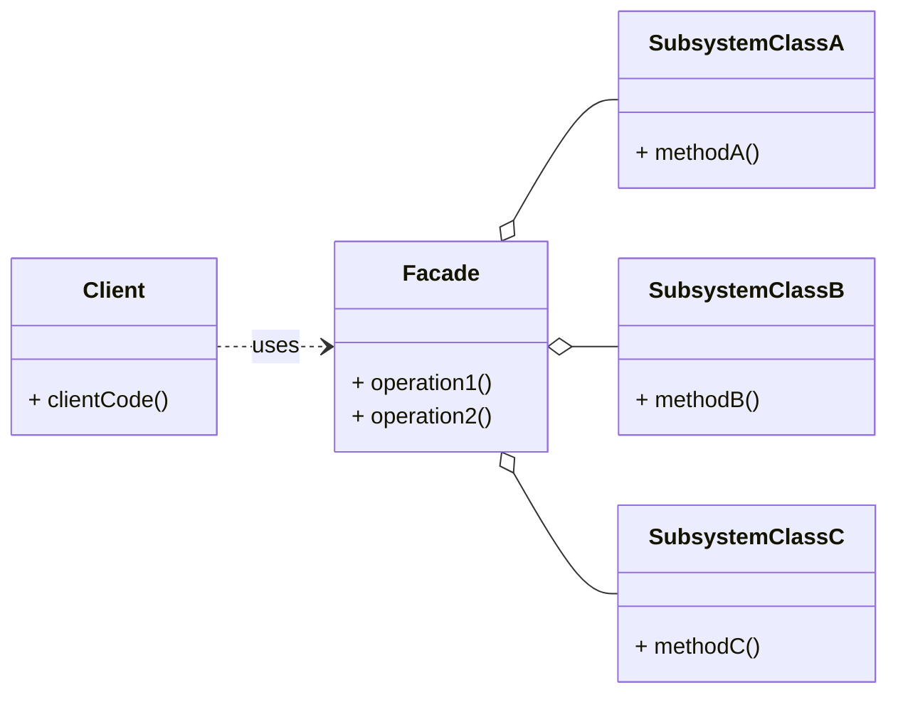

# Structural Pattern: Facade

## 1. Problem

When a system is composed of a large number of classes, or a complex subsystem, interacting with it directly can be difficult and involve many dependencies. Clients need to understand the intricate relationships and order of operations among these classes to perform even simple tasks. This leads to tight coupling between the client and the subsystem, making the client code complex, hard to maintain, and prone to errors.

For example, setting up a home theater system might involve turning on the projector, lowering the screen, turning on the amplifier, setting the correct input, adjusting the volume, and dimming the lights. Performing these actions individually every time is cumbersome and error-prone.

## 2. Solution

The **Facade** pattern provides a simplified interface to a complex subsystem. A facade is a single class that provides a simplified, higher-level interface to a set of interfaces in a subsystem, making the subsystem easier to use.

It involves creating a `Facade` class that encapsulates the complex interactions within a subsystem. The `Facade` provides a simpler, unified interface to the client, hiding the complexities of the subsystem's internal workings. The client interacts only with the `Facade`, which then delegates the requests to the appropriate objects within the subsystem.

## 3. Structure (UML Conceptual)



-   **Facade:** Provides a simplified, unified interface to a set of interfaces in the subsystem. It knows which subsystem classes are responsible for a request and delegates client requests to appropriate subsystem objects.
-   **Subsystem Classes:** Implement the subsystem's functionality. They do not know about the facade and have no reference to it. They can communicate directly with each other.
-   **Client:** Uses the `Facade` to interact with the subsystem. It does not directly interact with the complex subsystem classes.

## 4. Python Implementation Example (Home Theater Facade)

Let's create a `HomeTheaterFacade` to simplify the operation of a home theater system.

```python
# Subsystem Classes
class Projector:
    def on(self):
        return "Projector ON"

    def off(self):
        return "Projector OFF"

    def wide_screen_mode(self):
        return "Projector in widescreen mode"

class Screen:
    def up(self):
        return "Screen UP"

    def down(self):
        return "Screen DOWN"

class Amplifier:
    def on(self):
        return "Amplifier ON"

    def off(self):
        return "Amplifier OFF"

    def set_volume(self, volume):
        return f"Amplifier volume set to {volume}"

    def set_dvd(self):
        return "Amplifier input set to DVD"

class DVDPlayer:
    def on(self):
        return "DVD Player ON"

    def off(self):
        return "DVD Player OFF"

    def play(self, movie):
        return f"Playing movie: {movie}"

# Facade
class HomeTheaterFacade:
    def __init__(self, projector: Projector, screen: Screen, amplifier: Amplifier, dvd_player: DVDPlayer):
        self.projector = projector
        self.screen = screen
        self.amplifier = amplifier
        self.dvd_player = dvd_player

    def watch_movie(self, movie: str):
        results = []
        results.append(self.screen.down())
        results.append(self.projector.on())
        results.append(self.projector.wide_screen_mode())
        results.append(self.amplifier.on())
        results.append(self.amplifier.set_dvd())
        results.append(self.amplifier.set_volume(10))
        results.append(self.dvd_player.on())
        results.append(self.dvd_player.play(movie))
        return "\n".join(results)

    def end_movie(self):
        results = []
        results.append(self.dvd_player.off())
        results.append(self.amplifier.off())
        results.append(self.projector.off())
        results.append(self.screen.up())
        return "\n".join(results)

# Client Code
if __name__ == "__main__":
    projector = Projector()
    screen = Screen()
    amplifier = Amplifier()
    dvd_player = DVDPlayer()

    home_theater = HomeTheaterFacade(projector, screen, amplifier, dvd_player)

    print("Watching a movie:")
    print(home_theater.watch_movie("The Matrix"))

    print("\nEnding the movie:")
    print(home_theater.end_movie())
```

## 5. Pros and Cons

### Pros
-   **Simplifies Client Interface:** Provides a simpler, unified interface to a complex subsystem, making it easier to use.
-   **Decouples Client from Subsystem:** Reduces the dependencies between the client code and the complex internal workings of the subsystem.
-   **Improved Readability and Maintainability:** Client code becomes cleaner and easier to understand, as it interacts with a single facade object instead of many subsystem objects.
-   **Increased Testability:** The facade can be easily mocked or stubbed for testing purposes.

### Cons
-   **Can Become a God Object:** If the facade becomes too large and handles too many responsibilities, it can become a "God Object," violating the Single Responsibility Principle.
-   **Reduced Flexibility:** While simplifying the interface, it might hide some functionality that advanced clients might need, forcing them to bypass the facade.
