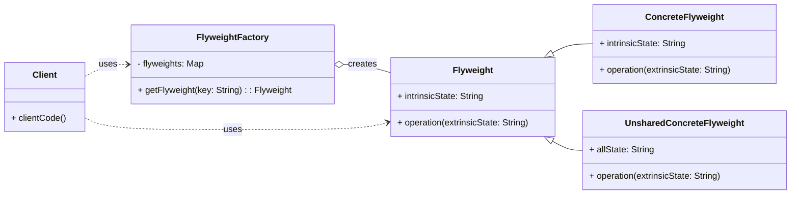

# Structural Pattern: Flyweight

## 1. Problem

When an application needs to create a large number of objects, and these objects are very similar, containing a lot of redundant information, it can lead to excessive memory consumption. Creating a new object for every instance, even if they share common intrinsic state, becomes inefficient.

For example, in a game with a vast forest, creating a unique `Tree` object for every single tree (each with its own `mesh`, `texture`, `color`, etc.) would quickly exhaust memory. Most trees might share the same `mesh` and `texture`, only differing in their `position` or `size`.

## 2. Solution

The **Flyweight** pattern minimizes memory usage or computation expenses by sharing as much data as possible with other similar objects. It achieves this by separating the intrinsic (shared) state from the extrinsic (unique) state of an object.

-   **Intrinsic State:** The part of an object's state that is constant and shared among multiple objects. This state is stored in `Flyweight` objects.
-   **Extrinsic State:** The part of an object's state that is unique to each object and varies. This state is passed to the `Flyweight` methods by the client or `Context` object.

The pattern typically involves a `FlyweightFactory` that manages and reuses `Flyweight` objects. When a client requests a `Flyweight`, the factory checks if an existing one with the same intrinsic state already exists. If so, it returns the existing object; otherwise, it creates a new one and stores it for future reuse.

## 3. Structure (UML Conceptual)



-   **Flyweight:** Declares an interface through which flyweights can receive and act on extrinsic state.
-   **ConcreteFlyweight:** Implements the `Flyweight` interface and adds storage for intrinsic state, if any. `ConcreteFlyweight` objects must be shareable.
-   **UnsharedConcreteFlyweight (Optional):** Not all `Flyweight` subclasses need to be shared. This class represents complex objects that might have a unique extrinsic state that cannot be shared.
-   **FlyweightFactory:** Creates and manages `Flyweight` objects. It ensures that flyweights are shared properly. When a client requests a flyweight, the factory returns an existing instance or creates a new one if it doesn't exist.
-   **Client:** Maintains references to flyweights and computes or stores the extrinsic state of flyweights.

## 4. Python Implementation Example (Forest Rendering)

Let's simulate rendering a forest with many trees, sharing common tree types (flyweights).

```python
from typing import Dict

# Flyweight: TreeType (Intrinsic State)
class TreeType:
    def __init__(self, name: str, color: str, texture: str):
        self.name = name
        self.color = color
        self.texture = texture

    def draw(self, canvas: str, x: int, y: int) -> str:
        # Extrinsic state (x, y) is passed by the client
        return f"Drawing {self.color} {self.name} tree with {self.texture} texture at ({x},{y}) on {canvas}"

# Flyweight Factory
class TreeFactory:
    _tree_types: Dict[str, TreeType] = {}

    @staticmethod
    def get_tree_type(name: str, color: str, texture: str) -> TreeType:
        key = f"{name}_{color}_{texture}"
        if key not in TreeFactory._tree_types:
            TreeFactory._tree_types[key] = TreeType(name, color, texture)
            print(f"Created new TreeType: {name} ({color}, {texture})")
        return TreeFactory._tree_types[key]

# Context: Tree (Extrinsic State)
class Tree:
    def __init__(self, x: int, y: int, tree_type: TreeType):
        self.x = x
        self.y = y
        self.tree_type = tree_type # Reference to a Flyweight object

    def draw(self, canvas: str) -> str:
        return self.tree_type.draw(canvas, self.x, self.y)

# Client: Forest
class Forest:
    def __init__(self):
        self.trees = []

    def plant_tree(self, x: int, y: int, name: str, color: str, texture: str):
        tree_type = TreeFactory.get_tree_type(name, color, texture)
        tree = Tree(x, y, tree_type)
        self.trees.append(tree)

    def draw(self, canvas: str):
        print(f"\nDrawing forest on {canvas}:")
        for tree in self.trees:
            print(tree.draw(canvas))

# Client Code
if __name__ == "__main__":
    forest = Forest()

    # Plant many trees, sharing TreeType objects
    forest.plant_tree(10, 20, "Oak", "Green", "Rough Bark")
    forest.plant_tree(20, 30, "Pine", "Dark Green", "Needle Texture")
    forest.plant_tree(15, 25, "Oak", "Green", "Rough Bark") # Reuses existing Oak TreeType
    forest.plant_tree(30, 40, "Pine", "Dark Green", "Needle Texture") # Reuses existing Pine TreeType
    forest.plant_tree(5, 10, "Maple", "Red", "Smooth Bark")

    forest.draw("Game Canvas")

    print(f"\nTotal unique tree types created: {len(TreeFactory._tree_types)}")
    # Expected: 3 (Oak, Pine, Maple), not 5 (total trees planted)
```

## 5. Pros and Cons

### Pros
-   **Memory Optimization:** Significantly reduces memory consumption when dealing with a large number of similar objects.
-   **Performance Improvement:** Can improve performance by reducing object creation overhead.
-   **Centralized State Management:** Intrinsic state is managed centrally by the `FlyweightFactory`.

### Cons
-   **Increased Complexity:** Introduces more classes and a more complex design, making it harder to understand and implement.
-   **Separation of State:** Requires careful separation of intrinsic and extrinsic state, which can be challenging.
-   **Runtime Computation:** Extrinsic state needs to be passed to the flyweight methods at runtime, which can sometimes add a slight overhead.
