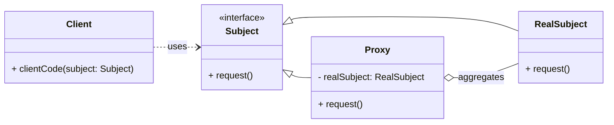

# Structural Pattern: Proxy

## 1. Problem

Sometimes, you need to control access to an object, add a layer of indirection, or perform additional actions (like logging, caching, or security checks) before or after accessing the real object. Directly interacting with the real object might be inefficient, insecure, or simply not feasible in certain scenarios.

For example, loading a very large image from a remote server can be slow and resource-intensive. You might want to defer the actual loading until the image is actually needed (lazy loading), or control who can access it, or cache it after the first load. Directly using the `RealImage` object would not provide these capabilities.

## 2. Solution

The **Proxy** pattern provides a surrogate or placeholder for another object to control access to it. A proxy acts as an intermediary, allowing you to add extra behavior when interacting with the real object.

It involves creating a `Proxy` class that implements the same interface as the `RealSubject` (the real object). The `Proxy` holds a reference to the `RealSubject` and, when its methods are called, it can perform additional logic (e.g., lazy initialization, access control, logging, caching) before or after delegating the call to the `RealSubject`.

## 3. Structure (UML Conceptual)



-   **Subject:** Declares the common interface for both `RealSubject` and `Proxy`. This allows the `Proxy` to be used anywhere the `RealSubject` is expected.
-   **RealSubject:** The actual object that the `Proxy` represents. It contains the core business logic.
-   **Proxy:** Maintains a reference to the `RealSubject`. It implements the `Subject` interface and controls access to the `RealSubject`. It can perform additional tasks before or after forwarding a request to the `RealSubject`.
-   **Client:** Interacts with the `Subject` interface, unaware of whether it's dealing with a `RealSubject` or a `Proxy`.

## 4. Python Implementation Example (Image Loader Proxy)

Let's create a `ProxyImage` that loads a `RealImage` only when its `display()` method is called (lazy loading).

```python
from abc import ABC, abstractmethod

# Subject Interface
class Image(ABC):
    @abstractmethod
    def display(self):
        pass

# Real Subject
class RealImage(Image):
    def __init__(self, filename: str):
        self.filename = filename
        self._load_image_from_disk() # Simulate heavy loading

    def _load_image_from_disk(self):
        print(f"Loading {self.filename} from disk...")
        # Simulate a delay for loading a large image
        import time
        time.sleep(1)
        print(f"Finished loading {self.filename}.")

    def display(self):
        return f"Displaying {self.filename}"

# Proxy
class ProxyImage(Image):
    def __init__(self, filename: str):
        self.filename = filename
        self._real_image = None # RealImage is not loaded yet

    def display(self):
        if self._real_image is None:
            print(f"Proxy: Real image for {self.filename} not loaded. Loading now...")
            self._real_image = RealImage(self.filename)
        return self._real_image.display()

# Client Code
if __name__ == "__main__":
    print("Client: Requesting image 1 (should load immediately)")
    image1 = RealImage("photo1.jpg")
    print(image1.display())

    print("\nClient: Requesting image 2 (should load via proxy on first display)")
    image2 = ProxyImage("photo2.jpg")
    print("Image 2 created, but not yet displayed.")
    print(image2.display()) # First display, real image loads
    print(image2.display()) # Second display, real image is already loaded

    print("\nClient: Requesting image 3 (should load via proxy on first display)")
    image3 = ProxyImage("photo3.jpg")
    print(image3.display()) # First display, real image loads
```

## 5. Pros and Cons

### Pros
-   **Controlled Access:** Provides a layer of control over the real object, allowing for lazy initialization, access control, logging, caching, etc.
-   **Reduced Resource Usage:** Can defer resource-intensive operations until they are actually needed (lazy loading).
-   **Separation of Concerns:** Separates the core business logic of the `RealSubject` from auxiliary concerns handled by the `Proxy`.
-   **Transparency:** The client interacts with the `Proxy` as if it were the `RealSubject`, as they share the same interface.

### Cons
-   **Increased Complexity:** Introduces an additional layer of abstraction and a new class, which can make the design more complex.
-   **Potential Performance Overhead:** The indirection introduced by the proxy can sometimes lead to a slight performance overhead, especially if the proxy performs complex operations before delegating.
-   **Overuse:** Can be overused, leading to unnecessary complexity for simple access control.
