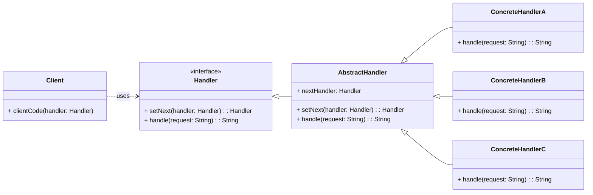

# Behavioral Pattern: Chain of Responsibility

## 1. Problem

When you have a request that can be handled by one of several objects, and you don't want to explicitly specify which object should handle the request. This often leads to tightly coupled code where the sender of a request is directly linked to its receiver, making it difficult to add new handlers or change the order of handling.

For example, in a customer support system, a request might need to be handled by different levels of support (e.g., Level 1 Support, Level 2 Support, Technical Lead). If the initial handler cannot process the request, it should be passed to the next handler in a sequence. Without the Chain of Responsibility, you might end up with complex conditional logic or direct calls between handlers.

## 2. Solution

The **Chain of Responsibility** pattern passes a request along a chain of handlers. Upon receiving a request, each handler decides either to process the request or to pass it to the next handler in the chain.

It involves defining a common interface for handlers. Each concrete handler typically stores a reference to the next handler in the chain. When a handler receives a request, it first checks if it can process it. If so, it processes the request; otherwise, it forwards the request to its successor. This allows you to build a chain of handlers dynamically and send requests through it without knowing which specific handler will process it.

## 3. Structure (UML Conceptual)



-   **Handler:** Declares an interface for handling requests. It also defines an interface for setting the next handler in the chain.
-   **AbstractHandler (Optional):** Provides a base implementation for the `Handler` interface, often including the linking mechanism for the chain.
-   **ConcreteHandler:** Implements the `handle()` method. It processes the request if it can, otherwise, it forwards the request to its successor.
-   **Client:** Sends requests to the first handler in the chain. It doesn't know which specific handler will process the request.

## 4. Python Implementation Example (Customer Support System)

Let's build a customer support system where requests are handled by different levels of support.

```python
from abc import ABC, abstractmethod
from typing import Optional

# Handler Interface
class SupportHandler(ABC):
    @abstractmethod
    def set_next(self, handler: 'SupportHandler') -> 'SupportHandler':
        pass

    @abstractmethod
    def handle_request(self, request: str) -> Optional[str]:
        pass

# Abstract Handler (Base Handler)
class AbstractSupportHandler(SupportHandler):
    _next_handler: Optional[SupportHandler] = None

    def set_next(self, handler: SupportHandler) -> SupportHandler:
        self._next_handler = handler
        return handler

    @abstractmethod
    def handle_request(self, request: str) -> Optional[str]:
        if self._next_handler:
            return self._next_handler.handle_request(request)
        return None # No handler could process the request

# Concrete Handlers
class Level1Support(AbstractSupportHandler):
    def handle_request(self, request: str) -> Optional[str]:
        if "simple" in request.lower() or "basic" in request.lower():
            return f"Level 1 Support handled: {request}"
        else:
            print(f"Level 1 Support cannot handle '{request}'. Passing to next...")
            return super().handle_request(request)

class Level2Support(AbstractSupportHandler):
    def handle_request(self, request: str) -> Optional[str]:
        if "technical" in request.lower() or "complex" in request.lower():
            return f"Level 2 Support handled: {request}"
        else:
            print(f"Level 2 Support cannot handle '{request}'. Passing to next...")
            return super().handle_request(request)

class TechnicalLead(AbstractSupportHandler):
    def handle_request(self, request: str) -> Optional[str]:
        if "critical" in request.lower() or "urgent" in request.lower():
            return f"Technical Lead handled: {request}"
        else:
            print(f"Technical Lead cannot handle '{request}'. Passing to next...")
            return super().handle_request(request)

# Client Code
if __name__ == "__main__":
    # Set up the chain
    level1 = Level1Support()
    level2 = Level2Support()
    tech_lead = TechnicalLead()

    level1.set_next(level2).set_next(tech_lead)

    # Send requests through the chain
    requests = [
        "basic query",
        "technical issue with network",
        "urgent critical server down",
        "simple password reset",
        "unknown request type"
    ]

    for req in requests:
        print(f"\nSending request: '{req}'")
        result = level1.handle_request(req)
        if result:
            print(f"Result: {result}")
        else:
            print(f"Result: Request '{req}' could not be handled by any support level.")
```

## 5. Pros and Cons

### Pros
-   **Loose Coupling:** Decouples the sender of a request from its receiver. The sender doesn't need to know which specific handler will process the request.
-   **Flexibility:** You can add new handlers or change the order of handlers in the chain dynamically without modifying existing client code or handlers.
-   **Reduced Conditional Logic:** Eliminates large conditional statements (if-else or switch-case) in the client code that would otherwise determine which handler to call.

### Cons
-   **Guaranteed Receipt:** There is no guarantee that the request will be handled by any handler in the chain, as it might reach the end of the chain without being processed.
-   **Debugging Challenges:** Debugging can be more complex as it's not immediately obvious which handler will process a request.
-   **Performance Overhead:** Requests might traverse a long chain, potentially leading to performance overhead.

```