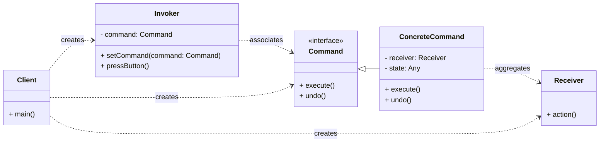

# Behavioral Pattern: Command

## 1. Problem

When you need to parameterize objects with an operation to perform, queue operations, undo operations, or support logging changes. This often arises when you want to decouple the sender of a request from the object that performs the request.

For example, consider a universal remote control for various devices (lights, garage door, stereo). Each button on the remote needs to perform a specific action on a specific device. If you hardcode the actions directly into the remote's buttons, adding new devices or changing actions becomes difficult. Also, implementing features like undo/redo or macros would be complex.

## 2. Solution

The **Command** pattern turns a request into a stand-alone object that contains all information about the request. This transformation lets you parameterize methods with different requests, delay or queue a request's execution, and support undoable operations.

It involves defining a `Command` interface with an `execute()` method. Concrete command classes implement this interface, encapsulating a specific action and its receiver. An `Invoker` (e.g., a remote control button) holds a `Command` object and, when triggered, calls its `execute()` method. The `Receiver` is the object that performs the actual work. This decouples the `Invoker` from the `Receiver` and the specific action.

## 3. Structure (UML Conceptual)



-   **Command:** Declares an interface for executing an operation.
-   **ConcreteCommand:** Implements the `Command` interface. It binds a `Receiver` object with an action and its parameters.
-   **Invoker:** Asks the command to carry out the request. It holds a `Command` object but doesn't know the `Receiver` or the specific action.
-   **Receiver:** Knows how to perform the operations associated with carrying out a request. Any class can act as a `Receiver`.
-   **Client:** Creates a `ConcreteCommand` object and sets its `Receiver`. It then associates the `Command` with the `Invoker`.

## 4. Python Implementation Example (Simple Remote Control)

Let's create a simple remote control that can turn lights on/off and control a garage door.

```python
from abc import ABC, abstractmethod
from typing import List

# Command Interface
class Command(ABC):
    @abstractmethod
    def execute(self):
        pass

    @abstractmethod
    def undo(self):
        pass

# Receiver: Light
class Light:
    def on(self):
        return "Light is ON"

    def off(self):
        return "Light is OFF"

# Receiver: GarageDoor
class GarageDoor:
    def up(self):
        return "Garage Door is OPEN"

    def down(self):
        return "Garage Door is CLOSED"

# Concrete Commands
class LightOnCommand(Command):
    def __init__(self, light: Light):
        self._light = light
        self._previous_state = None

    def execute(self):
        self._previous_state = "OFF" if self._light.on() == "Light is ON" else "ON"
        return self._light.on()

    def undo(self):
        if self._previous_state == "OFF":
            return self._light.off()
        elif self._previous_state == "ON":
            return self._light.on()
        return "Light state unknown for undo."

class LightOffCommand(Command):
    def __init__(self, light: Light):
        self._light = light
        self._previous_state = None

    def execute(self):
        self._previous_state = "ON" if self._light.off() == "Light is OFF" else "OFF"
        return self._light.off()

    def undo(self):
        if self._previous_state == "ON":
            return self._light.on()
        elif self._previous_state == "OFF":
            return self._light.off()
        return "Light state unknown for undo."

class GarageDoorUpCommand(Command):
    def __init__(self, garage_door: GarageDoor):
        self._garage_door = garage_door

    def execute(self):
        return self._garage_door.up()

    def undo(self):
        return self._garage_door.down()

class GarageDoorDownCommand(Command):
    def __init__(self, garage_door: GarageDoor):
        self._garage_door = garage_door

    def execute(self):
        return self._garage_door.down()

    def undo(self):
        return self._garage_door.up()

# Invoker: RemoteControl
class RemoteControl:
    def __init__(self):
        self._on_commands: List[Command] = [None] * 7
        self._off_commands: List[Command] = [None] * 7
        self._undo_command: Command = NoCommand()

    def set_command(self, slot: int, on_command: Command, off_command: Command):
        self._on_commands[slot] = on_command
        self._off_commands[slot] = off_command

    def on_button_was_pressed(self, slot: int):
        if self._on_commands[slot]:
            result = self._on_commands[slot].execute()
            self._undo_command = self._on_commands[slot]
            return result
        return "No command assigned to ON button."

    def off_button_was_pressed(self, slot: int):
        if self._off_commands[slot]:
            result = self._off_commands[slot].execute()
            self._undo_command = self._off_commands[slot]
            return result
        return "No command assigned to OFF button."

    def undo_button_was_pressed(self):
        return self._undo_command.undo()

# Null Object for no command
class NoCommand(Command):
    def execute(self):
        return "No command assigned."

    def undo(self):
        return "No command to undo."

# Client Code
if __name__ == "__main__":
    remote = RemoteControl()

    living_room_light = Light()
    garage_door = GarageDoor()

    light_on = LightOnCommand(living_room_light)
    light_off = LightOffCommand(living_room_light)
    garage_door_up = GarageDoorUpCommand(garage_door)
    garage_door_down = GarageDoorDownCommand(garage_door)

    remote.set_command(0, light_on, light_off)
    remote.set_command(1, garage_door_up, garage_door_down)

    print(remote.on_button_was_pressed(0))
    print(remote.off_button_was_pressed(0))
    print(remote.undo_button_was_pressed())

    print(remote.on_button_was_pressed(1))
    print(remote.undo_button_was_pressed())
    print(remote.off_button_was_pressed(1))
    print(remote.undo_button_was_pressed())

    print(remote.on_button_was_pressed(2)) # No command assigned
```

## 5. Pros and Cons

### Pros
-   **Decoupling:** Decouples the invoker from the receiver, making the system more flexible.
-   **Undo/Redo Functionality:** Easily supports undo/redo mechanisms by storing a history of executed commands.
-   **Queueing and Logging:** Commands can be queued, logged, and executed at different times.
-   **Extensibility:** Easy to add new commands without changing existing invoker or receiver classes.

### Cons
-   **Increased Complexity:** Introduces more classes (Command, ConcreteCommand, Invoker, Receiver), which can make the code more complex for simple operations.
-   **Overhead:** For very simple operations, the overhead of creating command objects might not be justified.
