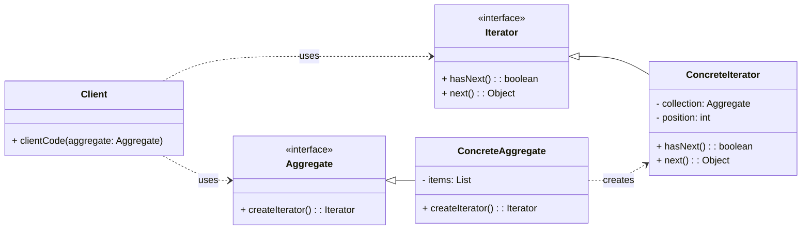

# Behavioral Pattern: Iterator

## 1. Problem

When you need to access the elements of a collection (like a list, array, or tree) sequentially without exposing its underlying representation. Different collections might have different internal structures, and directly iterating over them would require specific knowledge of each structure, leading to tightly coupled client code.

For example, if you have a `BookCollection` that stores books in a list, and another `MagazineCollection` that stores magazines in a dictionary, iterating over them would require different code for each. If you later change the internal representation of `BookCollection` from a list to a tree, all client code iterating over it would break.

## 2. Solution

The **Iterator** pattern provides a way to access the elements of an aggregate object sequentially without exposing its underlying representation.

It involves defining an `Iterator` interface with methods like `has_next()` and `next()`. Concrete iterator classes implement this interface for specific collection types. The collection (or `Aggregate`) provides a method to create an `Iterator` object. Clients interact with the `Iterator` interface, allowing them to traverse different collections uniformly without knowing their internal structure.

## 3. Structure (UML Conceptual)



-   **Iterator:** Declares an interface for accessing and traversing elements.
-   **ConcreteIterator:** Implements the `Iterator` interface. It keeps track of the current position in the traversal of the aggregate.
-   **Aggregate:** Declares an interface for creating an `Iterator` object.
-   **ConcreteAggregate:** Implements the `createIterator()` method to return an instance of the appropriate `ConcreteIterator`.
-   **Client:** Uses the `Iterator` interface to traverse the `Aggregate` without knowing its internal structure.

## 4. Python Implementation Example (Book Collection)

Let's create a `BookCollection` and an `Iterator` to traverse its books.

```python
from abc import ABC, abstractmethod
from typing import List, Any

# Iterator Interface
class BookIterator(ABC):
    @abstractmethod
    def has_next(self) -> bool:
        pass

    @abstractmethod
    def next(self) -> Any:
        pass

# Aggregate Interface
class BookCollection(ABC):
    @abstractmethod
    def create_iterator(self) -> BookIterator:
        pass

# Concrete Iterator
class ConcreteBookIterator(BookIterator):
    def __init__(self, collection: List[str]):
        self._collection = collection
        self._position = 0

    def has_next(self) -> bool:
        return self._position < len(self._collection)

    def next(self) -> Any:
        if not self.has_next():
            raise StopIteration()
        item = self._collection[self._position]
        self._position += 1
        return item

# Concrete Aggregate
class Library(BookCollection):
    def __init__(self):
        self._books: List[str] = []

    def add_book(self, book: str):
        self._books.append(book)

    def create_iterator(self) -> BookIterator:
        return ConcreteBookIterator(self._books)

# Client Code
if __name__ == "__main__":
    library = Library()
    library.add_book("The Hitchhiker's Guide to the Galaxy")
    library.add_book("Pride and Prejudice")
    library.add_book("1984")

    iterator = library.create_iterator()

    print("Iterating through the library:")
    while iterator.has_next():
        book = iterator.next()
        print(f"- {book}")

    print("\nUsing Python's built-in iterator protocol (more Pythonic):")
    # In Python, you often implement __iter__ and __next__ directly in the collection
    # or return an iterator object from __iter__.
    class PythonicLibrary:
        def __init__(self):
            self._books: List[str] = []

        def add_book(self, book: str):
            self._books.append(book)

        def __iter__(self):
            self._position = 0
            return self

        def __next__(self):
            if self._position >= len(self._books):
                raise StopIteration
            item = self._books[self._position]
            self._position += 1
            return item

    pythonic_library = PythonicLibrary()
    pythonic_library.add_book("Dune")
    pythonic_library.add_book("Foundation")

    for book in pythonic_library:
        print(f"- {book}")
```

## 5. Pros and Cons

### Pros
-   **Decoupling:** Decouples the traversal logic from the collection object, allowing them to vary independently.
-   **Uniform Traversal:** Provides a uniform way to traverse different collection types, simplifying client code.
-   **Multiple Traversals:** Allows multiple traversals of the same collection simultaneously.
-   **Encapsulation:** Hides the internal representation of the collection from the client.

### Cons
-   **Increased Complexity:** Introduces more classes (Iterator, ConcreteIterator, Aggregate, ConcreteAggregate) which can make the design more complex for simple collections.
-   **Overhead:** For very simple collections, the overhead of creating and managing iterator objects might not be justified.
