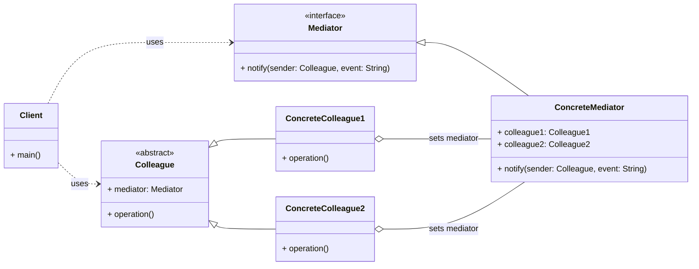

# Behavioral Pattern: Mediator

## 1. Problem

When a system has many objects that interact with each other, the direct connections between them can become complex and difficult to manage. This leads to tight coupling, where changes to one object require changes to many others, making the system hard to maintain, extend, and reuse. This is often referred to as the "spaghetti code" problem.

For example, in a graphical user interface (GUI), if a button click directly triggers actions in a text box, a list box, and a status bar, and these elements also interact with each other, the number of direct connections grows exponentially. Adding a new UI element or changing an interaction would require modifying many existing components.

## 2. Solution

The **Mediator** pattern defines an object that encapsulates how a set of objects interact. Mediator promotes loose coupling by keeping objects from referring to each other explicitly, and it lets you vary their interaction independently.

It involves creating a `Mediator` interface that defines methods for communication between `Colleague` objects. `Colleague` objects (the interacting objects) no longer communicate directly with each other; instead, they communicate only with the `Mediator`. The `Mediator` receives messages from `Colleagues` and forwards them to the appropriate `Colleagues`, acting as a central hub for communication. This centralizes control and reduces direct dependencies.

## 3. Structure (UML Conceptual)



-   **Mediator:** Defines an interface for communicating with `Colleague` objects.
-   **ConcreteMediator:** Implements the `Mediator` interface. It knows and maintains its `Colleagues`. It coordinates `Colleague` objects and handles their communication.
-   **Colleague:** Each `Colleague` class knows its `Mediator` object. `Colleagues` communicate with their mediator when they would otherwise communicate with another `Colleague`.
-   **ConcreteColleague:** Implements the `Colleague` interface. It communicates with its `Mediator` when an event occurs.

## 4. Python Implementation Example (Chat Room)

Let's create a chat room where users (colleagues) communicate through a chat room (mediator).

```python
from abc import ABC, abstractmethod
from typing import List

# Mediator Interface
class ChatRoomMediator(ABC):
    @abstractmethod
    def send_message(self, message: str, user: 'User'):
        pass

# Colleague Abstract Class
class User(ABC):
    def __init__(self, name: str, mediator: ChatRoomMediator = None):
        self.name = name
        self._mediator = mediator

    def set_mediator(self, mediator: ChatRoomMediator):
        self._mediator = mediator

    @abstractmethod
    def send(self, message: str):
        pass

    @abstractmethod
    def receive(self, message: str):
        pass

# Concrete Mediator
class ChatRoom(ChatRoomMediator):
    def __init__(self):
        self._users: List[User] = []

    def add_user(self, user: User):
        self._users.append(user)
        user.set_mediator(self)

    def send_message(self, message: str, sender: User):
        print(f"[ChatRoom] Message from {sender.name}: {message}")
        for user in self._users:
            if user != sender:
                user.receive(f"[{sender.name}] {message}")

# Concrete Colleagues
class ChatUser(User):
    def __init__(self, name: str, mediator: ChatRoomMediator = None):
        super().__init__(name, mediator)

    def send(self, message: str):
        if self._mediator:
            self._mediator.send_message(message, self)
        else:
            print(f"Error: {self.name} is not connected to a chat room.")

    def receive(self, message: str):
        print(f"[{self.name}] received: {message}")

# Client Code
if __name__ == "__main__":
    chat_room = ChatRoom()

    john = ChatUser("John")
    jane = ChatUser("Jane")
    mike = ChatUser("Mike")

    chat_room.add_user(john)
    chat_room.add_user(jane)
    chat_room.add_user(mike)

    print("\n--- Chat Session ---")
    john.send("Hi everyone!")
    jane.send("Hello John!")
    mike.send("What's up?")

    print("\n--- Adding a new user ---")
    alice = ChatUser("Alice")
    chat_room.add_user(alice)
    john.send("Welcome Alice!")
```

## 5. Pros and Cons

### Pros
-   **Loose Coupling:** Reduces direct dependencies between `Colleague` objects, as they only communicate with the `Mediator`.
-   **Centralized Control:** Centralizes the control logic of interactions, making it easier to understand and modify how objects interact.
-   **Improved Reusability:** `Colleague` objects become more reusable as they are not tightly coupled to specific peers.
-   **Simplifies Object Protocols:** Replaces many-to-many interactions with one-to-many interactions (Colleagues to Mediator).

### Cons
-   **Mediator Can Become a God Object:** The `Mediator` can become overly complex and difficult to maintain if it handles too many interactions or responsibilities.
-   **Single Point of Failure:** If the `Mediator` fails, the entire interaction system might break.
-   **Performance Overhead:** Introducing an extra layer of indirection can sometimes lead to a slight performance overhead.
