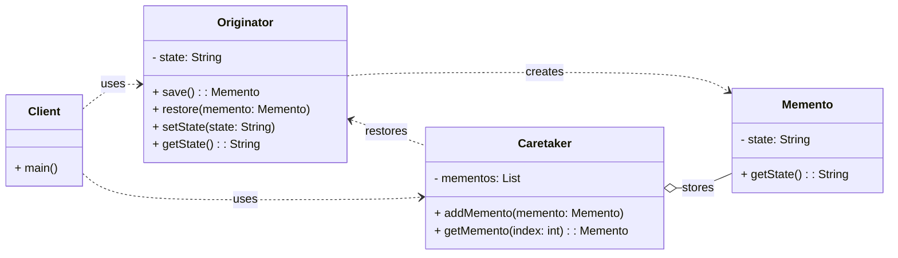

# Behavioral Pattern: Memento

## 1. Problem

When you need to save and restore the internal state of an object without violating its encapsulation. Directly exposing the object's internal state for saving and restoring would break encapsulation and make the object's implementation details public. This can lead to tight coupling and make the object harder to change.

For example, in a text editor, you might want to implement an undo/redo mechanism. To do this, you need to save the editor's state (the text content, cursor position, etc.) at various points. If you directly access and manipulate the editor's internal fields from outside, you violate its encapsulation.

## 2. Solution

The **Memento** pattern captures and externalizes an object's internal state without violating encapsulation, so that the object can be restored to this state later.

It involves three main roles:
-   **Originator:** The object whose state needs to be saved and restored. It creates a `Memento` containing a snapshot of its current state and uses a `Memento` to restore its state.
-   **Memento:** A passive object that stores a snapshot of the `Originator`'s internal state. It should be immutable and have a restricted interface, typically only accessible by the `Originator` and the `Caretaker`.
-   **Caretaker:** Responsible for keeping track of the `Memento`s. It never operates on or examines the contents of a `Memento`. It simply stores and retrieves them.

## 3. Structure (UML Conceptual)



-   **Originator:** The object whose state needs to be saved. It creates a `Memento` containing a snapshot of its current internal state and uses a `Memento` to restore its state.
-   **Memento:** A passive object that stores a snapshot of the `Originator`'s internal state. It should be immutable and have a restricted interface, typically only accessible by the `Originator` and the `Caretaker`.
-   **Caretaker:** Responsible for keeping track of the `Memento`s. It never operates on or examines the contents of a `Memento`. It simply stores and retrieves them.

## 4. Python Implementation Example (Text Editor Undo/Redo)

Let's implement a simple text editor with undo/redo functionality using the Memento pattern.

```python
# Memento
class EditorMemento:
    def __init__(self, content: str):
        self._content = content

    def get_saved_content(self) -> str:
        return self._content

# Originator
class TextEditor:
    def __init__(self):
        self._content = ""

    def type(self, words: str):
        self._content += words
        return f"Current content: {self._content}"

    def get_content(self) -> str:
        return self._content

    def save(self) -> EditorMemento:
        return EditorMemento(self._content)

    def restore(self, memento: EditorMemento):
        self._content = memento.get_saved_content()
        return f"Content restored to: {self._content}"

# Caretaker
class History:
    def __init__(self):
        self._mementos = []

    def save(self, editor: TextEditor):
        self._mementos.append(editor.save())
        print("State saved.")

    def undo(self, editor: TextEditor):
        if not self._mementos:
            print("No states to undo.")
            return
        memento = self._mementos.pop()
        editor.restore(memento)
        print("Undo successful.")

# Client Code
if __name__ == "__main__":
    editor = TextEditor()
    history = History()

    print(editor.type("This is the first sentence. "))
    history.save(editor)

    print(editor.type("This is the second sentence. "))
    history.save(editor)

    print(editor.type("And the third one."))

    print("\nPerforming undo...")
    history.undo(editor)
    print(f"Editor content after undo: {editor.get_content()}")

    print("\nPerforming another undo...")
    history.undo(editor)
    print(f"Editor content after second undo: {editor.get_content()}")

    print("\nTrying to undo again (no more states)...")
    history.undo(editor)
```

## 5. Pros and Cons

### Pros
-   **Encapsulation Preservation:** Allows saving and restoring an object's state without violating its encapsulation.
-   **Undo/Redo Functionality:** Ideal for implementing undo/redo mechanisms, checkpoints, or rollback features.
-   **Simplified Originator:** The `Originator` doesn't need to manage the history of its states; the `Caretaker` handles that.

### Cons
-   **Memory Consumption:** Storing many mementos can consume a significant amount of memory, especially for large `Originator` states.
-   **Complexity:** Can introduce additional classes and complexity, especially if the `Originator` has a very complex state that requires deep copying.
-   **Performance Overhead:** Creating and storing mementos can introduce performance overhead.
