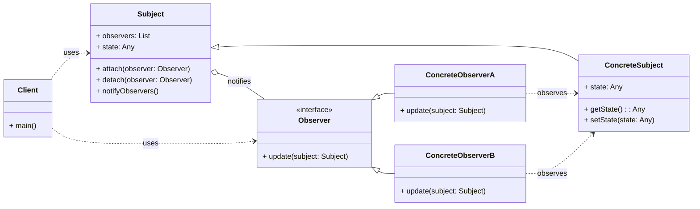

# Behavioral Pattern: Observer

## 1. Problem

When an object (the "Subject") changes its state, and other objects (the "Observers") need to be notified and updated automatically. Directly coupling the Subject to all its Observers creates a tight dependency, making the system rigid and difficult to extend or modify. If you add a new Observer, you have to modify the Subject, violating the Open/Closed Principle.

For example, in a weather station, when temperature or humidity changes, multiple displays (e.g., current conditions display, statistics display, forecast display) need to update. If the weather station directly calls methods on each display, adding a new display type would require modifying the weather station's code.

## 2. Solution

The **Observer** pattern defines a one-to-many dependency between objects so that when one object changes state, all its dependents are notified and updated automatically.

It involves two main types of objects:
-   **Subject (or Observable):** The object that maintains a list of its dependents (observers) and notifies them of state changes. It provides methods for attaching and detaching observers.
-   **Observer:** The object that wants to be notified of changes in the Subject. It provides an `update()` method that the Subject calls when its state changes.

This pattern promotes loose coupling between the Subject and its Observers. The Subject only knows about the `Observer` interface, not about concrete Observer classes. Observers can be added or removed dynamically without affecting the Subject.

## 3. Structure (UML Conceptual)



-   **Subject (or Observable):** The object that maintains a list of its dependents (observers) and notifies them of state changes. It provides methods for attaching (`attach()`) and detaching (`detach()`) observers, and a method to notify all registered observers (`notifyObservers()`).
-   **Concrete Subject:** Implements the `Subject` interface. It stores the state of interest to `ConcreteObserver` objects and sends a notification to its observers when its state changes.
-   **Observer:** Defines an updating interface for objects that should be notified of changes in a subject.
-   **Concrete Observer:** Implements the `Observer` updating interface. It registers itself with a `ConcreteSubject` and stores a reference to the `ConcreteSubject`. It updates its state to reflect the subject's state when notified.

## 4. Python Implementation Example (Weather Station)

Let's implement a weather station (Subject) that notifies different displays (Observers) when weather data changes.

```python
from abc import ABC, abstractmethod
from typing import List

# Subject Interface
class WeatherStationSubject(ABC):
    @abstractmethod
    def register_observer(self, observer: 'WeatherDisplayObserver'):
        pass

    @abstractmethod
    def remove_observer(self, observer: 'WeatherDisplayObserver'):
        pass

    @abstractmethod
    def notify_observers(self):
        pass

# Observer Interface
class WeatherDisplayObserver(ABC):
    @abstractmethod
    def update(self, temperature: float, humidity: float, pressure: float):
        pass

# Concrete Subject
class WeatherData(WeatherStationSubject):
    def __init__(self):
        self._observers: List[WeatherDisplayObserver] = []
        self._temperature: float = 0.0
        self._humidity: float = 0.0
        self._pressure: float = 0.0

    def register_observer(self, observer: WeatherDisplayObserver):
        self._observers.append(observer)

    def remove_observer(self, observer: WeatherDisplayObserver):
        self._observers.remove(observer)

    def notify_observers(self):
        for observer in self._observers:
            observer.update(self._temperature, self._humidity, self._pressure)

    def set_measurements(self, temperature: float, humidity: float, pressure: float):
        self._temperature = temperature
        self._humidity = humidity
        self._pressure = pressure
        self.notify_observers()

# Concrete Observers
class CurrentConditionsDisplay(WeatherDisplayObserver):
    def __init__(self, weather_data: WeatherData):
        self._temperature = 0.0
        self._humidity = 0.0
        self._weather_data = weather_data
        self._weather_data.register_observer(self)

    def update(self, temperature: float, humidity: float, pressure: float):
        self._temperature = temperature
        self._humidity = humidity
        self.display()

    def display(self):
        print(f"Current conditions: {self._temperature}°F and {self._humidity}% humidity")

class StatisticsDisplay(WeatherDisplayObserver):
    def __init__(self, weather_data: WeatherData):
        self._max_temp = 0.0
        self._min_temp = 200.0
        self._temp_sum = 0.0
        self._num_readings = 0
        self._weather_data = weather_data
        self._weather_data.register_observer(self)

    def update(self, temperature: float, humidity: float, pressure: float):
        self._temp_sum += temperature
        self._num_readings += 1
        if temperature > self._max_temp:
            self._max_temp = temperature
        if temperature < self._min_temp:
            self._min_temp = temperature
        self.display()

    def display(self):
        print(f"Avg/Max/Min temperature = {self._temp_sum / self._num_readings:.2f}/{self._max_temp}/{self._min_temp}")

# Client Code
if __name__ == "__main__":
    weather_data = WeatherData()

    current_display = CurrentConditionsDisplay(weather_data)
    statistics_display = StatisticsDisplay(weather_data)

    print("\nFirst set of measurements:")
    weather_data.set_measurements(80, 65, 30.4)

    print("\nSecond set of measurements:")
    weather_data.set_measurements(82, 70, 29.2)

    print("\nRemoving statistics display and new measurements:")
    weather_data.remove_observer(statistics_display)
    weather_data.set_measurements(78, 90, 29.2)
```

## 5. Pros and Cons

### Pros
-   **Loose Coupling:** Subject and Observers are loosely coupled. The Subject only knows about the `Observer` interface, not concrete Observer classes.
-   **Extensibility:** Easy to add new Observers without modifying the Subject.
-   **Reusability:** Observers can be reused with different Subjects.
-   **Broadcast Communication:** A Subject can notify multiple Observers simultaneously.

### Cons
-   **Unexpected Updates:** Observers might receive updates they don't care about, leading to unnecessary processing.
-   **Debugging Challenges:** The flow of control can be hard to trace due to indirect communication.
-   **Performance Issues:** If there are many Observers, notifying all of them can be slow.
-   **Order of Notification:** The order in which Observers are notified is usually not guaranteed.
