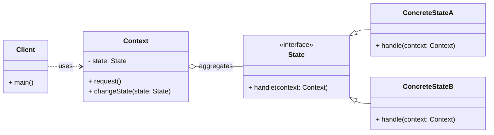

# Behavioral Pattern: State

## 1. Problem

When an object's behavior changes depending on its internal state, and this behavior is implemented using large, conditional statements (e.g., `if/else` or `switch/case`) that check the object's current state. This approach leads to several issues:

-   **Complex and Hard-to-Maintain Code:** The conditional logic becomes unwieldy as the number of states and state-dependent behaviors grows.
-   **Violation of Open/Closed Principle:** Adding a new state or modifying behavior for an existing state requires changing the central conditional logic, which means modifying existing code.
-   **Duplication of Code:** Similar state-transition logic might be duplicated across different methods.

For example, a `TrafficLight` object might have states like `Red`, `Yellow`, and `Green`. Its `handle_request()` method would contain a large `if/else` block to determine what to do based on the current light color.

## 2. Solution

The **State** pattern allows an object to alter its behavior when its internal state changes. The object will appear to change its class.

It achieves this by creating separate classes for each state. The original object (the `Context`) delegates its state-dependent behavior to an object of one of these state classes. The `Context` maintains a reference to a `State` object, and when its state changes, it simply changes the `State` object it references. Each `State` object implements a common `State` interface, defining the behavior for that specific state.

## 3. Structure (UML Conceptual)



-   **Context:** Defines the interface of interest to clients. It maintains an instance of a `ConcreteState` subclass that defines the current state. It delegates state-specific requests to the current `State` object.
-   **State:** Declares an interface for encapsulating the behavior associated with a particular state of the `Context`. It typically defines methods that correspond to the state-dependent operations of the `Context`.
-   **ConcreteState:** Each subclass implements a behavior associated with a state of the `Context`. It also handles state transitions, often by calling a method on the `Context` to change its current `State` object.

## 4. Python Implementation Example (Traffic Light)

Let's implement a `TrafficLight` that changes its behavior based on its current color (state).

```python
from abc import ABC, abstractmethod

# State Interface
class TrafficLightState(ABC):
    @abstractmethod
    def handle(self, light: 'TrafficLight'):
        pass

    @abstractmethod
    def get_status(self) -> str:
        pass

# Concrete States
class RedLightState(TrafficLightState):
    def handle(self, light: 'TrafficLight'):
        print("Traffic Light: Red -> Green")
        light.set_state(GreenLightState())

    def get_status(self) -> str:
        return "Red"

class YellowLightState(TrafficLightState):
    def handle(self, light: 'TrafficLight'):
        print("Traffic Light: Yellow -> Red")
        light.set_state(RedLightState())

    def get_status(self) -> str:
        return "Yellow"

class GreenLightState(TrafficLightState):
    def handle(self, light: 'TrafficLight'):
        print("Traffic Light: Green -> Yellow")
        light.set_state(YellowLightState())

    def get_status(self) -> str:
        return "Green"

# Context
class TrafficLight:
    def __init__(self):
        self._state: TrafficLightState = RedLightState() # Initial state

    def set_state(self, state: TrafficLightState):
        self._state = state

    def change(self):
        self._state.handle(self)

    def get_current_status(self) -> str:
        return self._state.get_status()

# Client Code
if __name__ == "__main__":
    traffic_light = TrafficLight()

    print(f"Initial status: {traffic_light.get_current_status()}")

    traffic_light.change() # Red -> Green
    print(f"Current status: {traffic_light.get_current_status()}")

    traffic_light.change() # Green -> Yellow
    print(f"Current status: {traffic_light.get_current_status()}")

    traffic_light.change() # Yellow -> Red
    print(f"Current status: {traffic_light.get_current_status()}")

    traffic_light.change() # Red -> Green
    print(f"Current status: {traffic_light.get_current_status()}")
```

## 5. Pros and Cons

### Pros
-   **Organizes State-Specific Behavior:** Consolidates all behavior associated with a particular state into a single class, making it easier to manage.
-   **Simplifies Context Code:** Eliminates large conditional statements in the `Context` class, making it cleaner and more maintainable.
-   **Adheres to Open/Closed Principle:** New states can be added by creating new `ConcreteState` classes without modifying existing `Context` or `State` classes.
-   **Improved Testability:** Individual state classes can be tested independently.

### Cons
-   **Increased Number of Classes:** Introduces a new class for each state, which can increase the overall number of classes in the system, potentially making it more complex for simple state machines.
-   **Overhead for Simple States:** For objects with very few states and simple transitions, the overhead of implementing the State pattern might not be justified.
