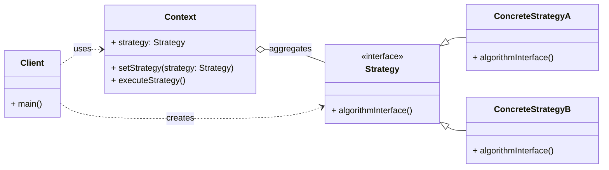

# Behavioral Pattern: Strategy

## 1. Problem

When you have multiple algorithms or behaviors that can be used interchangeably within a specific context, and you want to select one of them at runtime. If you implement all these algorithms directly within the context class, it leads to several issues:

-   **Large and Complex Context Class:** The context class becomes bloated with many conditional statements (if/else, switch/case) to select and execute the appropriate algorithm.
-   **Tight Coupling:** The context class is tightly coupled to all the specific algorithms, making it difficult to add new algorithms or modify existing ones without changing the context.
-   **Code Duplication:** Similar logic might be duplicated across different algorithm implementations.

For example, an e-commerce application might need to calculate shipping costs using different algorithms (e.g., standard shipping, express shipping, international shipping). Implementing all these calculations directly in the `ShoppingCart` class would make it complex.

## 2. Solution

The **Strategy** pattern defines a family of algorithms, encapsulates each one, and makes them interchangeable. Strategy lets the algorithm vary independently from clients that use it.

It involves three main components:
-   **Context:** The class that uses a `Strategy` object. It maintains a reference to a `Strategy` object and delegates the execution of the algorithm to it.
-   **Strategy:** An interface (or abstract class) that declares a common interface for all supported algorithms. The Context uses this interface to call the algorithm defined by a `ConcreteStrategy`.
-   **Concrete Strategy:** Implements the `Strategy` interface, providing a specific implementation of the algorithm.

## 3. Structure (UML Conceptual)



-   **Context:** Maintains a reference to a `Strategy` object. It can be configured with a `ConcreteStrategy` object. It delegates the execution of the algorithm to the `Strategy` object.
-   **Strategy:** Declares an interface common to all supported algorithms. `Context` uses this interface to call the algorithm defined by a `ConcreteStrategy`.
-   **Concrete Strategy:** Implements the `Strategy` interface, providing a specific implementation of the algorithm.

## 4. Python Implementation Example (Payment Processing)

Let's implement a shopping cart that can process payments using different payment strategies (e.g., Credit Card, PayPal).

```python
from abc import ABC, abstractmethod

# Strategy Interface
class PaymentStrategy(ABC):
    @abstractmethod
    def pay(self, amount: float) -> str:
        pass

# Concrete Strategies
class CreditCardPayment(PaymentStrategy):
    def __init__(self, card_number: str, cvv: str, expiry_date: str):
        self.card_number = card_number
        self.cvv = cvv
        self.expiry_date = expiry_date

    def pay(self, amount: float) -> str:
        return f"Paying ${amount:.2f} using Credit Card {self.card_number[-4:]}"

class PayPalPayment(PaymentStrategy):
    def __init__(self, email: str, password: str):
        self.email = email
        self.password = password

    def pay(self, amount: float) -> str:
        return f"Paying ${amount:.2f} using PayPal account {self.email}"

# Context
class ShoppingCart:
    def __init__(self, payment_strategy: PaymentStrategy):
        self._payment_strategy = payment_strategy
        self._items = []

    def set_payment_strategy(self, payment_strategy: PaymentStrategy):
        self._payment_strategy = payment_strategy

    def add_item(self, item: str, price: float):
        self._items.append({"item": item, "price": price})

    def checkout(self) -> str:
        total_amount = sum(item["price"] for item in self._items)
        return self._payment_strategy.pay(total_amount)

# Client Code
if __name__ == "__main__":
    # Pay with Credit Card
    credit_card_strategy = CreditCardPayment("1234-5678-9012-3456", "123", "12/25")
    cart1 = ShoppingCart(credit_card_strategy)
    cart1.add_item("Laptop", 1200.00)
    cart1.add_item("Mouse", 25.00)
    print(cart1.checkout())

    print("\n" + "-"*30 + "\n")

    # Pay with PayPal
    paypal_strategy = PayPalPayment("user@example.com", "mysecretpassword")
    cart2 = ShoppingCart(paypal_strategy)
    cart2.add_item("Keyboard", 75.00)
    cart2.add_item("Monitor", 300.00)
    print(cart2.checkout())

    print("\n" + "-"*30 + "\n")

    # Change strategy at runtime
    cart3 = ShoppingCart(credit_card_strategy) # Start with credit card
    cart3.add_item("Headphones", 150.00)
    print(cart3.checkout())
    cart3.set_payment_strategy(paypal_strategy) # Change to PayPal
    cart3.add_item("Microphone", 50.00)
    print(cart3.checkout())
```

## 5. Pros and Cons

### Pros
-   **Interchangeable Algorithms:** Allows you to swap algorithms used by an object at runtime.
-   **Decoupling:** Decouples the context from the specific algorithm implementations.
-   **Avoids Conditional Logic:** Eliminates large conditional statements in the context class.
-   **Adheres to Open/Closed Principle:** New strategies can be added without modifying the context class.

### Cons
-   **Increased Number of Classes:** Introduces a new class for each algorithm, which can increase the overall number of classes in the system.
-   **Client Must Know Strategies:** The client must be aware of the different strategies and choose the appropriate one.
-   **Overhead for Simple Algorithms:** For very simple algorithms, the overhead of implementing the Strategy pattern might not be justified.
