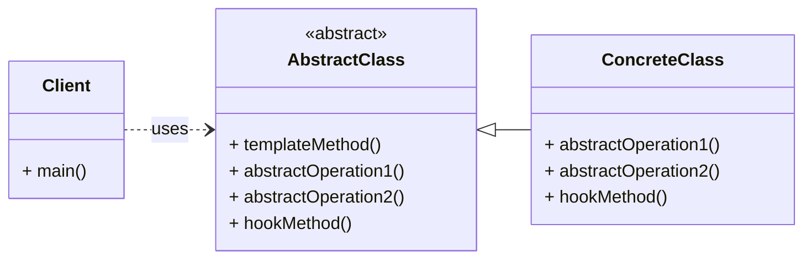

# Behavioral Pattern: Template Method

## 1. Problem

When you have a common algorithm or process that consists of multiple steps, but some of these steps need to be implemented differently by various subclasses. If you try to implement the entire algorithm in a base class, and then override specific steps in subclasses, you might end up with:

-   **Code Duplication:** Similar boilerplate code for the overall algorithm might be repeated in subclasses.
-   **Inflexibility:** It can be difficult to enforce the overall structure of the algorithm while allowing subclasses to customize specific parts.
-   **Violation of Open/Closed Principle:** Changes to the overall algorithm structure might require modifying all subclasses.

For example, preparing different beverages (coffee, tea) involves a similar sequence of steps: boil water, brew, pour, add condiments. However, the brewing and adding condiments steps differ for each beverage.

## 2. Solution

The **Template Method** pattern defines the skeleton of an algorithm in an operation, deferring some steps to subclasses. Template Method lets subclasses redefine certain steps of an algorithm without changing the algorithm's structure.

It involves an abstract base class (the `AbstractClass`) that defines the overall algorithm as a `template method`. This template method calls a series of abstract methods (or hook methods with default implementations) that are implemented by concrete subclasses. The `AbstractClass` controls the overall flow, while subclasses provide the specific implementations for the varying steps.

## 3. Structure (UML Conceptual)



-   **AbstractClass:** Defines the template method, which is the skeleton of an algorithm. It also defines abstract operations that `ConcreteClass`es must implement, and may define hook operations that `ConcreteClass`es can optionally override.
-   **ConcreteClass:** Implements the abstract operations to carry out subclass-specific steps of the algorithm. It can also override hook operations to provide additional behavior.

## 4. Python Implementation Example (Beverage Preparation)

Let's prepare different beverages (coffee and tea) using a common template.

```python
from abc import ABC, abstractmethod

# Abstract Class
class CaffeineBeverage(ABC):
    def prepare_recipe(self):
        # This is the template method
        print("\n--- Preparing Beverage ---")
        self.boil_water()
        self.brew()
        self.pour_in_cup()
        self.add_condiments()
        print("--- Beverage Ready!---")

    def boil_water(self):
        print("Boiling water")

    def pour_in_cup(self):
        print("Pouring into cup")

    @abstractmethod
    def brew(self):
        pass

    @abstractmethod
    def add_condiments(self):
        pass

# Concrete Class: Coffee
class Coffee(CaffeineBeverage):
    def brew(self):
        print("Dripping coffee through filter")

    def add_condiments(self):
        print("Adding sugar and milk")

# Concrete Class: Tea
class Tea(CaffeineBeverage):
    def brew(self):
        print("Steeping the tea bag")

    def add_condiments(self):
        print("Adding lemon")

# Client Code
if __name__ == "__main__":
    coffee_maker = Coffee()
    coffee_maker.prepare_recipe()

    tea_maker = Tea()
    tea_maker.prepare_recipe()
```

## 5. Pros and Cons

### Pros
-   **Code Reusability:** Common parts of the algorithm are implemented once in the abstract base class.
-   **Inversion of Control:** The abstract class controls the overall flow of the algorithm, while subclasses provide specific implementations for varying steps.
-   **Enforces Algorithm Structure:** Ensures that the overall structure of the algorithm is maintained across all subclasses.
-   **Adheres to Open/Closed Principle:** New variations of the algorithm can be added by creating new concrete subclasses without modifying the existing abstract class.

### Cons
-   **Increased Complexity:** Can introduce more classes and abstract methods, which might be overkill for simple algorithms.
-   **Limited Flexibility:** The overall structure of the algorithm is fixed by the template method, limiting the flexibility of subclasses to change the sequence of steps.
-   **Difficulty in Changing Template:** Modifying the template method (e.g., adding a new step in the middle) can require changes in all subclasses.
