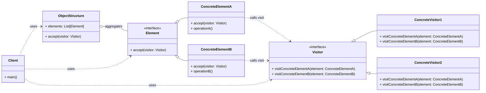

# Behavioral Pattern: Visitor

## 1. Problem

When you need to perform new operations on objects of an existing object structure (e.g., a tree of different node types) without modifying the classes of those objects. If you add new operations directly to the object classes, it leads to several issues:

-   **Violation of Open/Closed Principle:** Modifying existing classes to add new operations means they are not closed for modification.
-   **Scattered Code:** Operations related to a single concern might be scattered across multiple classes, making it hard to understand and maintain.
-   **Difficulty in Adding New Operations:** Adding a new operation requires modifying every class in the object structure.

For example, in a document structure with `Paragraph`, `Heading`, and `Image` elements, you might need to export the document to different formats (e.g., HTML, Markdown, PDF). If you add `to_html()`, `to_markdown()`, `to_pdf()` methods to each element class, it quickly becomes unmanageable.

## 2. Solution

The **Visitor** pattern represents an operation to be performed on the elements of an object structure. Visitor lets you define a new operation without changing the classes of the elements on which it operates.

It involves two main components:
-   **Visitor:** An interface (or abstract class) that declares a `visit()` method for each concrete element type in the object structure. Each `visit()` method takes a concrete element as an argument.
-   **Element:** An interface (or abstract class) that defines an `accept()` method. This method takes a `Visitor` object as an argument.
-   **Concrete Element:** Implements the `Element` interface and its `accept()` method. The `accept()` method typically calls the corresponding `visit()` method on the passed `Visitor` object, passing `self` as an argument.
-   **Concrete Visitor:** Implements the `Visitor` interface, providing a specific implementation for each `visit()` method. Each `ConcreteVisitor` defines a new operation to be performed on the elements.

## 3. Structure (UML Conceptual)



-   **Visitor:** Declares a `Visit` operation for each class of `ConcreteElement` in the object structure.
-   **ConcreteVisitor:** Implements each `Visit` operation declared by `Visitor`. Each operation implements a fragment of the algorithm defined for the corresponding class of object.
-   **Element:** Declares an `Accept` operation that takes a `Visitor` as an argument.
-   **ConcreteElement:** Implements an `Accept` operation that takes a `Visitor` as an argument.
-   **ObjectStructure (Optional):** Can enumerate its elements and provide a high-level interface to accept a visitor.

## 4. Python Implementation Example (Document Converter)

Let's convert a document structure (Paragraph, Heading) to different formats (HTML, Markdown) using the Visitor pattern.

```python
from abc import ABC, abstractmethod
from typing import List

# Element Interface
class DocumentElement(ABC):
    @abstractmethod
    def accept(self, visitor: 'DocumentVisitor'):
        pass

# Concrete Elements
class Paragraph(DocumentElement):
    def __init__(self, text: str):
        self.text = text

    def accept(self, visitor: 'DocumentVisitor'):
        visitor.visit_paragraph(self)

class Heading(DocumentElement):
    def __init__(self, text: str, level: int):
        self.text = text
        self.level = level

    def accept(self, visitor: 'DocumentVisitor'):
        visitor.visit_heading(self)

# Visitor Interface
class DocumentVisitor(ABC):
    @abstractmethod
    def visit_paragraph(self, paragraph: Paragraph):
        pass

    @abstractmethod
    def visit_heading(self, heading: Heading):
        pass

# Concrete Visitors
class HTMLConverter(DocumentVisitor):
    def __init__(self):
        self.output = []

    def visit_paragraph(self, paragraph: Paragraph):
        self.output.append(f"<p>{paragraph.text}</p>")

    def visit_heading(self, heading: Heading):
        self.output.append(f"<h{heading.level}>{heading.text}</h{heading.level}>")

    def get_html(self) -> str:
        return "\n".join(self.output)

class MarkdownConverter(DocumentVisitor):
    def __init__(self):
        self.output = []

    def visit_paragraph(self, paragraph: Paragraph):
        self.output.append(paragraph.text)

    def visit_heading(self, heading: Heading):
        self.output.append("#" * heading.level + f" {heading.text}")

    def get_markdown(self) -> str:
        return "\n".join(self.output)

# Object Structure (Document)
class Document:
    def __init__(self, elements: List[DocumentElement]):
        self.elements = elements

    def accept(self, visitor: DocumentVisitor):
        for element in self.elements:
            element.accept(visitor)

# Client Code
if __name__ == "__main__":
    document = Document([
        Heading("Introduction", 1),
        Paragraph("This is a sample paragraph."),
        Heading("Conclusion", 2),
        Paragraph("End of document.")
    ])

    # Convert to HTML
    html_converter = HTMLConverter()
    document.accept(html_converter)
    print("\n--- HTML Output ---")
    print(html_converter.get_html())

    # Convert to Markdown
    markdown_converter = MarkdownConverter()
    document.accept(markdown_converter)
    print("\n--- Markdown Output ---")
    print(markdown_converter.get_markdown())
```

## 5. Pros and Cons

### Pros
-   **Separation of Concerns:** Separates operations from the object structure, allowing new operations to be added without modifying element classes.
-   **Open/Closed Principle:** Element classes are closed for modification (no need to change them for new operations), but open for extension (new visitors can be added).
-   **Centralized Operations:** Related operations are grouped together in a single `Visitor` class.
-   **Flexibility:** Can work with complex object structures (e.g., trees, graphs).

### Cons
-   **Increased Complexity:** Introduces more classes and interfaces, which can make the design more complex.
-   **Adding New Element Types is Hard:** If you add a new `ConcreteElement` type, you must update every `Visitor` interface and all `ConcreteVisitor` implementations to include a `visit()` method for the new element.
-   **Breaks Encapsulation:** Visitors often need to access the internal state of `ConcreteElement`s, potentially breaking their encapsulation.
